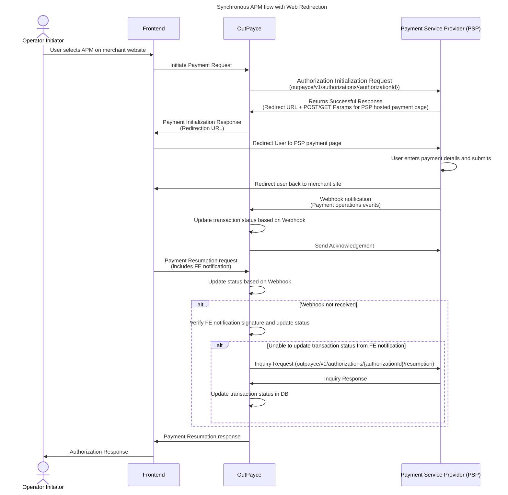
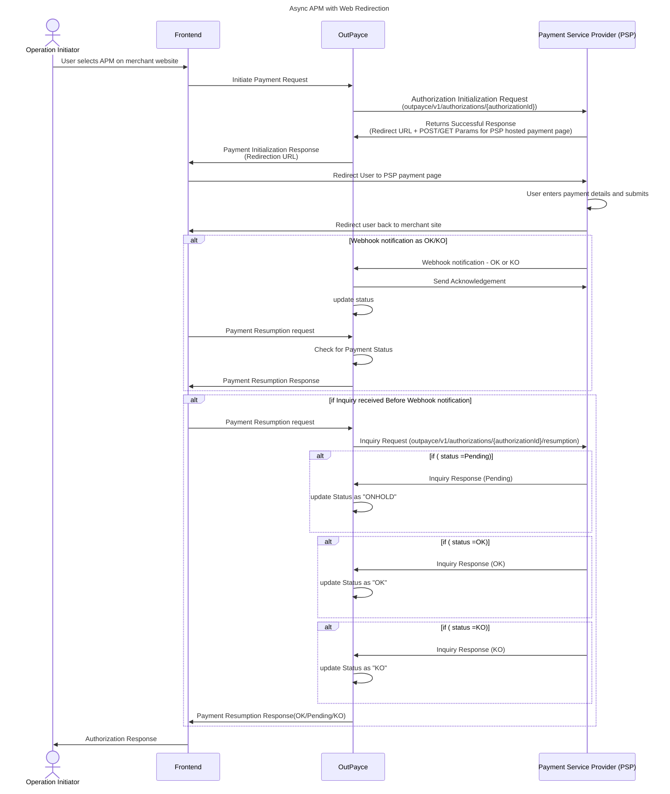
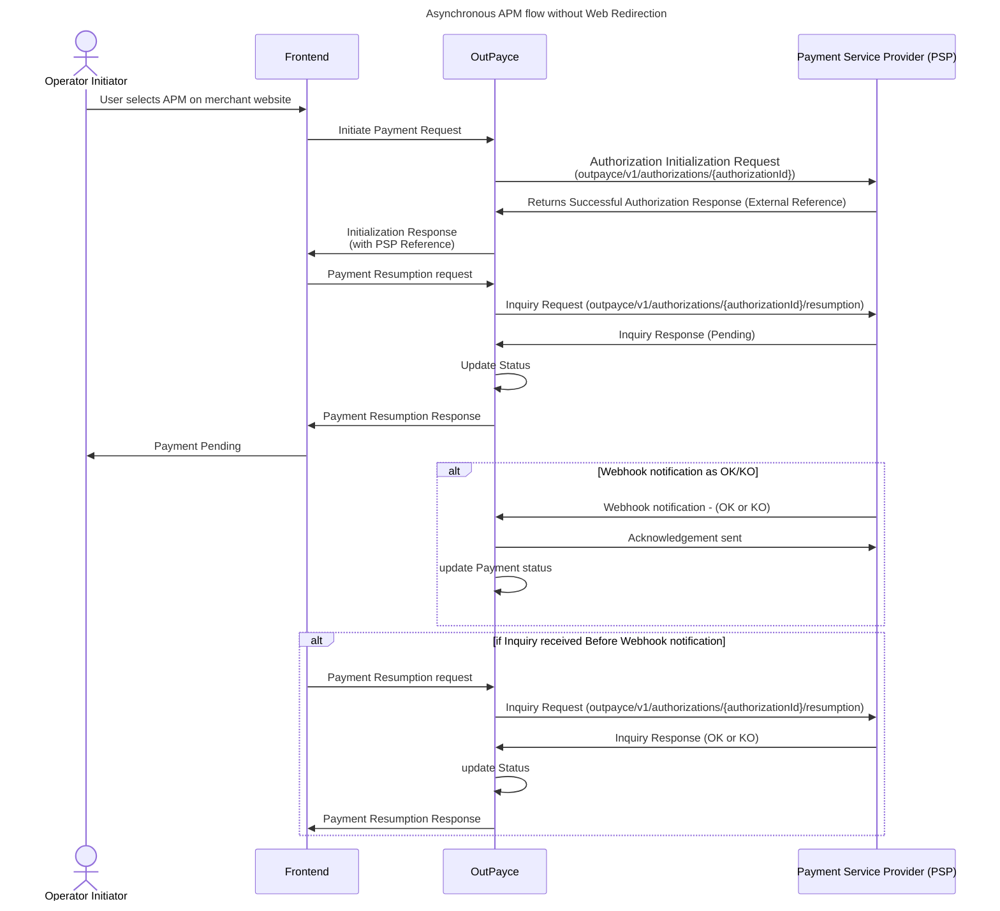
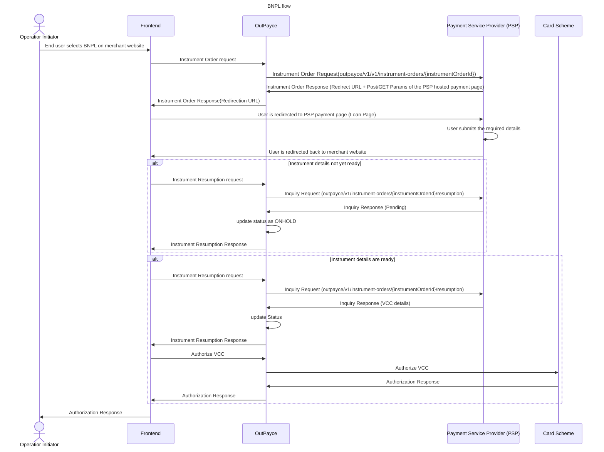
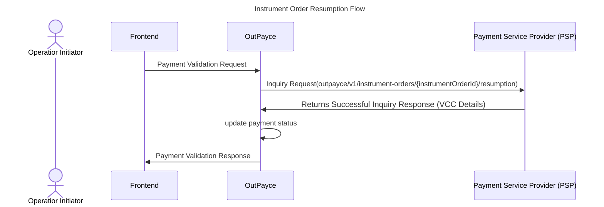
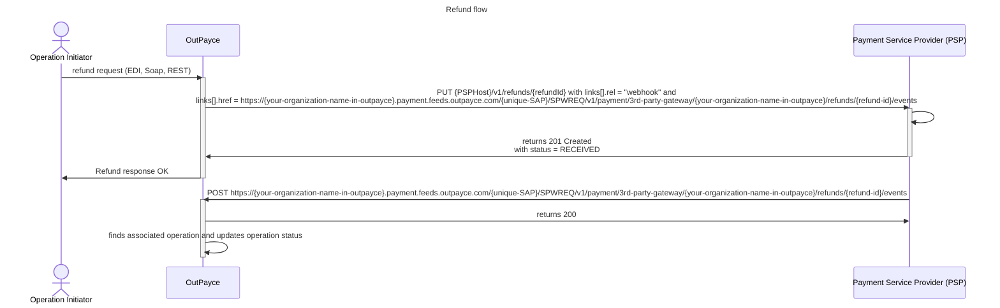

# Connect API User Guide 
## **Purpose and Scope**

This user guide describes the payment features and functionalities offered by Outpayce’s Payment Operations swagger, also known as Connect API swagger. The scope of this user guide concerns only Payments done via Alternative Payment methods (APMs) or "Buy Now, Pay Later" (BNPL) options. Alternative Payment Methods (APMs) refer to non-card-based payment options such as e-wallets, bank transfers, local payment schemes, and QR code-based payments. BNPL (Buy Now, Pay Later) with VCC (Virtual Credit Card) is a payment method that generates a temporary virtual card for completing the purchase, enabling customers to defer payment and settle in installments.

This document includes detailed descriptions of all fields currently supported in Connect API as well as detailed examples and scenarios of the payment operations currently supported. The aim of this document is to enhance and supplement the existing swagger specification.

It is recommended to read the data objects/elements together with the swagger specification to understand which data to provide, how and when to provide it. Tables are used in this specification with rows holding the data objects/elements while the applicability columns indicating whether the data element/object is applicable for specific capability.

Applicability is indicated using the following notions:

•	**“M”** - Mandatory:     &nbsp;&nbsp;&nbsp;&nbsp;&nbsp;   *Needed in order to process a request or response through Connect API.*

•	**“C”** - Conditional:  &nbsp;&nbsp;&nbsp;&nbsp;&nbsp;   *May be present or needed depending on the usecase or capability.*
 
• **“O”** - Optional:   &nbsp; &nbsp;  &nbsp;&nbsp;&nbsp;&nbsp;&nbsp;   *Not usually needed to perform a payment transaction but is  added if available.* 
 
•	**“N/A”**   &nbsp;&nbsp; &nbsp;&nbsp;&nbsp;&nbsp;    *If a field is marked N/A for a scheme it means that the field is not part of the transaction to that specific scheme.*

## API Basics
Connect API is a RESTful Service and its endpoints are called using HTTP requests formatted as JSON.

## Environment and URLs
Outpayce provides up to three different environments. Two environments for testing and for you to validate your integration, as well as a Production environment. This allows you to provide different host for each of the environments.
We use different urls in test and production that follow a specific format for the 2 main operation types supported by Connect API (Authorization & Refund). <br> The url structure is **_https://{your-host-name}/outpayce/v1/{endpoint-path}_** where: 

_**- {your-host-name}**_ is the base URL you provide alongside the endpoint you are using to host the API on your side.<br>
_**- {endpoint-path}**_ is the operation type specific path described in our specification swagger.
 <br><br>
 
However, for payment operations events, a different URL is used:
 
**https://_your-organization-name-in-outpayce.payment.feeds.outpayce.com/{attributed-sap}/{<3-char-prefix>}REQ/v1/payment/3rd-party-gateway/{your-organization-name-in-outpayce}/{operation-collection}/{operation-id}/events_** where:

_**- {attributed_sap}**_ is a uniquely created sap (service access point) attributed to you that is communicated during the API integration. <br>
_**- {your-organization-name-in-outpayce}**_ is the agreed name attributed by outpayce to you during the onboarding phase. <br>
_**- {<3-char-prefix>}REQ:**_ A dynamic segment where the first three characters can be any value, followed by REQ.
Examples: SPWREQ, XYZREQ, ABCREQ. <br>
_**- {payment.feeds.outpayce.com/{attributed-sap}/{<3-char-prefix>}REQ/v1/payment/3rd-party-gateway}**_ is the Outpayce part of the link that is necessary to target the good component <br>
_**- {operation-collection}**_ is the collection of the concerned operation type. It is therefore either **authorizations** or **refunds**.<br>
_**- {operation-id}**_ is the identifier of the operation generated by Outpayce.

#### URL Examples
 
Payment Operations full URL in test environment :  
`https://{your-host-name_in-test}/outpayce/v1/authorizations/{operationId}`

Payment Operations full URL in production environment : 
`https://{your-host-name_in-production}/outpayce/v1/authorizations/{operationId}`

 
Payment Operations Events URL in test environment:  
`https://{your-organization-name-in-outpayce}.payment.test.feeds.outpayce.com/{attributed-sap}/SPWREQ/v1/payment/3rd-party-gateway/{your-organization-name-in-outpayce}/authorizations/{operation-id}/events`

Payment Operations Events URL in production environment: 
`https://{your-organization-name-in-outpayce}.payment.feeds.outpayce.com/{attributed-sap}/{<3-char-prefix>}REQ/v1/payment/3rd-party-gateway/{your-organization-name-in-outpayce}/authorizations/{operation-id}/events`


## API versioning 

Connect API employs versioning. In any event, Outpayce notifies you of a new release of Connect API. If the newly released version is backward compatible, you have to update your server code in order to benefit from the new features of this new version. If the new version is not backward compatible (new major version), you have to apply for a new certification process to account for the new major changes. Minor adjustments that are classified as patches, such as text modifications do not prompt a new certification process or API update.

## **Connect API supported capabilities:**

- [Single-step **Authorization**](#2-authorization-operation) for
    -  [Synchronous Alternative Payment Methods with Web Redirection](#21-synchronous-alternative-payment-methods-with-web-redirection)<br> 
      - [Basic Authorization](#211-basic-authorization) <br>
      - [Authorization with Airline Sales Summary data](#212-authorization-with-airline-sales-summary-data) <br>
      - [Authorization with Hotel Sales Summary data](#213-authorization-with-hotel-sales-summary-data) <br>
      - [Authorization with Payer Inputs Data](#214-apm-authorization-with-payer-inputs-data) <br>
    - [Asynchronous Alternative Payment Methods with Web Redirection](#22-asynchronous-alternative-payment-methods-with-redirection) <br>
    - [Asynchronous Alternative Payment Methods without Web Redirection](#23-asynchronous-alternative-payment-methods-without-web-redirection) <br>
- [**Instrument Order**](#3-instrument-order): Used to request a payment instrument through the Instrument Orders API. This endpoint retrieves the Virtual Credit Card (VCC) generated during BNPL (Buy Now Pay Later) loan processing.<br> 
- [**Refund**](#4-refund-operation): Full, Partial and Multiple<br> 
- [**Payment Operation Events**](#5-payment-operations-events): Send updates regarding the final status of a **authorization** or **refund** operation. <br>

## 1 Merchant Account Setup

Outpayce initiates Connect API Payment Operations Request on behalf of merchants. A merchant is identified in your system by a **Merchant Account**. It may even be attributed a **Merchant login** with an associated **Merchant password**.

## 2 Authorization Operation

APMs are processed using the Multi-steps Authorization process.
Multi-steps Authorization refers to a payment process where the authorization of a transaction is not completed in a single step but involves multiple stages or interactions between the payment partner, OutPayce, and sometimes the payer.

OutPayce supports authorization of multiple APM flavours:

•	**Synchronous APM with Web Redirection**: <br>
The customer completes the payment in a single session, and the result is immediately available.

•	**Asynchronous APM with/without Web Redirection**: <br> 
The payment confirmation is delayed and may require callbacks or follow-up actions to finalize the transaction.


### 2.1 Synchronous Alternative Payment Methods with Web Redirection

In a **synchronous** flow, the payer completes the payment in a single session - after selecting the APM, the payer is redirected to your hosted payment page, completes the payment, and is immediately redirected back to the merchant site/application via the submitted default-callback URL with a payment result (success or failure).

The diagram below illustrates the sequence of API message calls that occur during the authorization process:



### 2.1.1 Basic Authorization

#### 2.1.1.1 Step 1 - Authorization Initialization before Web Redirection: <br>
When the payer agrees to pay with an alternative payment method like Paypal for an amount of 123.45€, Outpayce captures the selected alternative payment method, collects the required information and sends the Initialization request to your system.


##### 2.1.1.1.1 Description
This is a basic authorization scenario where required alternative payment method information is provided to initiate the authorization process. This set of data is always sent as part of an authorization request, regardless of usecase.

##### 2.1.1.1.2 Request parameters
| Field | Applicability | Comments | Expected Format | 
|---------------------|---------------|--------------------------------------------------------------------------------|-----------------------------------| 
| id | M | OutPayce operation identifier | string |  
| authorizationType | M | Indicates how the capture is triggered | "AUTHOR_AND_CAPTURE" | 
| method | M | Method of Payment requested at authorization time | string Enum: AMOP <br>  If APM, then instrument.paymentSystem is provided. |  
| amount.value | M | Value of the amount | string |
| amount.currencyCode | M | Currency of the indicated amount | string, <br> *minLength: 3, maxLength: 3* <br>|
| instrument.paymentSystem | M | Provides the Selected Payment Instrument Information - Upper case key representing the supported payment system chosen by the payer from a predetermined list of APMs. Note - Optional for certain APMs which require Bank related payer information for processing, refer Section [2.1.3 APM Authorization with Payer Inputs Data](#213-apm-authorization-with-payer-inputs-data) | string <br> For example "PAYPAL". |
| paymentMerchantReference | M | Identifier of the operation generated by the merchant | string |
| timestamp | M| Datetime of the operation | String,    Format: <br> *"date-time"* <br> |
| pointOfInteraction.location.address.countryCode               | M             | Country code from where the authorization is initiated|       String,    Format: <br> *ISO 3166-1 Country code* <br>  For example, "IN"         |
| operationContext.merchantAccount.name           | M             | Name identifying the merchant in the service host system.       | string           |
| operationContext.merchantAccount.login          | M             | Login of a user registered in the service host system and belonging to the merchant.       | string           |
| operationContext.merchantAccount.password.payload| M             | User password.                                                  | string           |
| operationContext.links.[{href,rel}] | M | | object | 
| operationContext.links[].rel | M | Relation of the link. In addition to IANA standard relations, payment area bears domain specific ones: <br> "default-callback" to indicate the URL where the payer should be redirected after completing the payment on the provider’s page. <br> <br>"webhook" to indicate where the API consumer is expected to update the status of a specific operation. Please refer to the [Payment Operation Events API](#5-payment-operations-events) for more details. | string | 
| operationContext.links[].href | M | Absolute or relative URL. | string |
| operationContext.device.activeWebBrowser.ietfLanguageTag | M | Preferred language tag used by most of modern computing standards as defined in the IETF BCP-47 (eg. "en", "fr-CA", "pt-BR", "nan-Hant-TW",...). | string,     Format: <br> *IETF BCP-47* <br> For example, "en", "fr-CA", "pt-BR", "nan-Hant-TW" |


##### Basic Authorization Initialization Request example:

```json
  PUT https://{your-host-name}/outpayce/v1/authorizations/{authorizationId} HTTP/1.1
  Content-Type: application/vnd.amadeus+json
  ...

{
    "data": {
        "id": "{authorizationId}",
        "method": "AMOP",
        "amount": {
            "value": "123.45",
            "currencyCode": "EUR"
        },
        "instrument": {
            "paymentSystem": "PAYPAL"
        },
        "paymentMerchantReference": "RECLOCAPPI100000567",
        "authorizationType": "AUTHOR_AND_CAPTURE",
        "timestamp": "2027-05-22T23:59:55Z",
        "pointOfInteraction": {
            "location": {
                "address": {
                    "countryCode": "FR"
                }
            }
        },
        "operationContext": {
            "merchantAccount": {
                "name": "MERCHANT_ACCOUNT",
                "login": "merchantLogin",
                "password": {
                    "payload": "merchantPassword"
                }
            },
            "links": [
                {
                    "rel": "https://mysite.amadeus.com/landingpage/uniquereference123/confirm",
                    "href": "default-callback"
                },
                {
                    "rel": "webhook",
                    "href": "https://{your-organization-name-in-outpayce}.payment.feeds.outpayce.com/{attributed-sap}/SPWREQ/v1/payment/3rd-party-gateway/{your-organization-name-in-outpayce}/authorizations/{authorizationId}/events"
                }
            ],
            "device": {
                "activeWebBrowser": {
                    "ietfLanguageTag": "en"
                }
            }
        }
    }
}

```

#### 2.1.1.1.3 Response parameters
The table below contains the minimum amount of data Outpayce expects to receive in the response of a successful authorization. Without at least the fields tagged as **Mandatory**, Outpayce is not able to process the Authorization response. <br>
   | Object/Field Name   | Applicability   | Comments                                                          | Expected Format   |
   |----------------------|------------------|-------------------------------------------------------------------|--------------------|
   | id                   | M                | OutPayce operation identifier                                     | string             |
   | externalId               | M                | Identifier of the operation generated by the service host               | string  |
   | timestamp            | M                | Datetime of the operation                                          | String,    Format: <br> *"date-time"* <br> |
   | status         | M                | Operation status | string, <br> For example, "ACCEPTED"             |
| targetPayloads.[{href,method,formPayload}] | M | | object | 
| targetPayloads[].href | M | URL where the payer should be redirected to completing the payment | string | 
| targetPayloads[].method | M | HTTP Method of the item | string <br> For example, "GET", "POST" | 
| targetPayloads[].formPayload.[{name,value}] | C | Form Parameters to be passed if method is POST | object |
| targetPayloads[].formPayload[].name | M |  Name of the form item | string |
| targetPayloads[].formPayload[].value | M | Value of the form item | string |


##### Basic Authorization Initialization Response example:

```json
HTTP/1.1 202 Accepted
Location: https://{your-host-name}/outpayce/v1/authorizations/{authorizationId}
Content-Type: application/vnd.amadeus+json

{
    "data": {
        "id": "{authorizationId}",
        "externalId": "1WX80207GX642472G",
        "status": "ACCEPTED",
        "timestamp": "2027-05-22T23:59:55Z",
        "targetPayloads": [
            {
                "href": "REDIRECTION_WEB_PAGE",
                "method": "POST",
                "formPayload": [
                    {
                        "name": "param1",
                        "value": "value1"
                    },
                    {
                        "name": "param2",
                        "value": "value2"
                    }
                ]
            }
        ]
    }
}
```

In this response example, REDIRECTION_WEB_PAGE is the landing page to redirect the payer in order to complete the payment.

After a successful redirection by the merchant, and completion of payment by the payer, Outpayce expects you to redirect the payer back to the merchant along with additional parameters. Please refer to the "Connect API Frontend Notification.md" for more information.

#### 2.1.1.2 Step 2 - Authorization Resumption: <br>
If Outpayce has not received the final authorization status through the Webhook (Refer [Payment Operations Events section](#5-payment-operations-events) for details) and, after receiving the Frontend Notification (refer to the "Connect API Frontend Notification.md"), is still unable to interpret the status, Outpayce will initiate an authorization resumption request to your system to retrieve the correct status.

##### 2.1.1.2.1 Resumption Request:
Each Payment Operation initiated is assigned a unique **Operation Identifier** by OutPayce. This identifier is included both in the request endpoint and in the **id** field of the payload. When OutPayce initiates a **Authorization Resumption** request, it uses the same Operation Identifier and expects the Authorization status to be returned in the resumption response.

##### Authorization Resumption Request example:

```json
POST https://{your-host-name}/outpayce/v1/authorizations/{authorizationId}/resumption HTTP/1.1
Content-Type: application/vnd.amadeus+json

{}
```

#### 2.1.1.2.2 Resumption Response parameters:

The table below contains the minimum amount of data Outpayce expects to receive in the response of a successful authorization. Without at least the fields tagged as **Mandatory**, Outpayce is not able to process the Authorization response. <br>
   | Object/Field Name   | Applicability   | Comments                                                          | Expected Format   |
   |----------------------|------------------|-------------------------------------------------------------------|--------------------|
   | id                   | M                | OutPayce operation identifier, echoed from Request                                     | string             |
   | externalId               | M                | Identifier of the operation generated by the service host               | string  |
  | status      | M                | Operation status - "AUTHORIZED" in case of successful Authorization | string, <br>           |
   | timestamp            | O                | Datetime of the operation                                          | String,    Format: <br> *"date-time"* <br> |


##### Authorization Resumption Response example:

```json
HTTP/1.1 201 Created
Content-Type: application/vnd.amadeus+json

{
    "data": {
        "id": "{authorizationId}",
        "externalId": "EXTERNAL_ID",
        "status": "AUTHORIZED",
        "timestamp": "2027-11-28T23:59:55Z"
    }
} 
```

### 2.1.2 Authorization with Airline Sales Summary data


   #### 2.1.2.1 Description
   This is an authorization request populated with sales summary data which can include flight and passenger details.

   #### 2.1.2.2 Request parameters
  The same data in a basic authorization request is provided, alongside the additional data highlighted below:
  | Field | Applicability | Comments | Expected Format | 
   |------------------------------|---------|-----------------------------------------------------------------------------------------------------------------|------------------------------------------------|
   | purposeOfOperation | O | Purpose of the payment operation |Object |
   | purposeOfOperation.sales[] | O| Payment operation of the type Sales | Array of Objects | 
   | purposeOfOperation.sales[].reference |O | Reference identifying the sales |string  | 
   | purposeOfOperation.sales[].referenceType |O  | Type of the reference identifying the sales | string| 
   | purposeOfOperation.sales[].referenceOwner | O | Owner of reference type |string | 
   | purposeOfOperation.sales[].salesItems[] |O | Sales items information | Array of Objects | 
   | purposeOfOperation.sales[].salesItems[].category |O  | Category best qualifying the sales item |String, Enum: FLIGHT | 
   | purposeOfOperation.sales[].salesItems[].flightSalesDetails | O | Flight detailed item description as a sales summary item |Object  | 
   | purposeOfOperation.sales[].salesItems[].flightSalesDetails.flightLegs[] | O | Flight itinerary details associated to a given passenger as sales summary flight details at flight segment level | Array of Objects | 
   | purposeOfOperation.sales[].salesItems[].flightSalesDetails.flightLegs[].fareBasisCode | O | Airline fare basis code identifying a fare type |String| 
   | purposeOfOperation.sales[].salesItems[].flightSalesDetails.flightLegs[].departureAirportCode | O | IATA 3-letter code representing the airport of departure of that flight leg | string|
   | purposeOfOperation.sales[].salesItems[].flightSalesDetails.flightLegs[].departureTime |O | UTC date and time of the scheduled departure, compliant with ISO8601 | string | 
   | purposeOfOperation.sales[].salesItems[].flightSalesDetails.flightLegs[].arrivalAirportCode |O | IATA 3-letter code representing the airport of arrival of that flight leg |string  | 
   | purposeOfOperation.sales[].salesItems[].flightSalesDetails.flightLegs[].arrivalTime |O  | UTC date and time of the scheduled arrival, compliant with ISO8601 | string| 
   | purposeOfOperation.sales[].salesItems[].flightSalesDetails.flightLegs[].carrierCode | O | IATA code of the carrier in charge of that flight segment |string | 
   | purposeOfOperation.sales[].salesItems[].flightSalesDetails.flightLegs[].couponNumber | O | Flight coupon number |string | 
   | purposeOfOperation.sales[].salesItems[].flightSalesDetails.flightLegs[].flightNumber |O  | Flight number associated to the carrier in charge of that flight segment |string |
   | purposeOfOperation.sales[].salesItems[].flightSalesDetails.flightLegs[].serviceClass |O  | Reference identifying the class of travel and included services |string | 
   | purposeOfOperation.sales[].salesItems[].flightSalesDetails.flightLegs[].travelDate |O  | Day when travel over that segment begins |string | 
   | purposeOfOperation.sales[].salesItems[].flightSalesDetails.passenger | O | Passenger of the flight | Object| 
   | purposeOfOperation.sales[].salesItems[].flightSalesDetails.passenger.flightPassengerType | O | Specifies flight passenger type | string, Enum: ADULT, CHILD, INFANT, INFANT_WITH_SEAT| 
   | purposeOfOperation.sales[].salesItems[].flightSalesDetails.passenger.name |O | Description of the name of a physical person |Object  | 
   | purposeOfOperation.sales[].salesItems[].flightSalesDetails.passenger.name.firstName | O | Passenger’s first name |string | 
   | purposeOfOperation.sales[].salesItems[].flightSalesDetails.passenger.name.lastName |O  | Passenger’s last name |string |
   | purposeOfOperation.sales[].salesItems[].flightSalesDetails.travelAgencyCode| O | Code identifying the travel agency responsible for the sale| string|
   | purposeOfOperation.sales[].salesItems[].flightSalesDetails.travelAgencyName| O | Name of the travel agency responsible for the sale| string|
   | purposeOfOperation.sales[].salesItems[].flightSalesDetails.issuingCarrierCode| O  | IATA code of the validating carrier| string|

##### Authorization Initialization request with Airline Sales Summary data example 1:

```json
  PUT https://{your-host-name}/outpayce/v1/authorizations/{authorizationId} HTTP/1.1
  Content-Type: application/vnd.amadeus+json
  ...

{
    "data": {
        "id": "{authorizationId}",
        "method": "AMOP",
        "amount": {
            "value": "123.45",
            "currencyCode": "EUR"
        },
        "instrument": {
            "paymentSystem": "PAYPAL"
        },
        "paymentMerchantReference": "RECLOCAPPI100000567",
        "authorizationType": "AUTHOR_AND_CAPTURE",
        "purposeOfOperation": {
            "sales": [
                {
                    "reference": "RECLOC",
                    "referenceOwner": "MERCHANT",
                    "referenceType": "PNR",
                    "salesItems": [
                        {
                            "category": "FLIGHT",
                            "flightSalesDetails": {
                                "flightLegs": [
                                    {
                                        "flightNumber": "6X12456A",
                                        "departureTime": "2027-06-30T11:40:00Z",
                                        "departureAirportCode": "NCE",
                                        "arrivalTime": "2027-06-30T13:40:00Z",
                                        "arrivalAirportCode": "PAR",
                                        "carrierCode": "6X",
                                        "serviceClass": "L"
                                    }
                                ],
                                "passenger": {
                                    "name": {
                                        "firstName": "MARIE",
                                        "lastName": "JACOB"
                                    },
                                    "flightPassengerType": "ADULT"
                                }
                            }
                        }
                    ]
                }
            ]
        },
        "timestamp": "2027-05-22T23:59:55Z",
        "pointOfInteraction": {
            "location": {
                "address": {
                    "countryCode": "FR"
                }
            }
        },
        "operationContext": {
            "merchantAccount": {
                "name": "MERCHANT_ACCOUNT",
                "login": "merchantLogin",
                "password": {
                    "payload": "merchantPassword"
                }
            },
            "links": [
                {
                    "rel": "https://mysite.amadeus.com/landingpage/uniquereference123/confirm",
                    "href": "default-callback"
                },
                {
                    "rel": "webhook",
                    "href": "https://{your-organization-name-in-outpayce}.payment.feeds.outpayce.com/{attributed-sap}/SPWREQ/v1/payment/3rd-party-gateway/{your-organization-name-in-outpayce}/authorizations/{authorizationId}/events"
                }
            ],
            "device": {
                "activeWebBrowser": {
                    "ietfLanguageTag": "en"
                }
            }
        }
    }
}
```

 ##### Authorization Initialization request with Airline Sales Summary data example 2:

```json
  PUT https://{your-host-name}/outpayce/v1/authorizations/{authorizationId} HTTP/1.1
  Content-Type: application/vnd.amadeus+json
  ...

{
    "data": {
        "id": "{authorizationId}",
        "method": "AMOP",
        "amount": {
            "value": "123.45",
            "currencyCode": "EUR"
        },
        "instrument": {
            "paymentSystem": "PAYPAL"
        },
        "paymentMerchantReference": "RECLOCAPPI100000567",
        "authorizationType": "AUTHOR_AND_CAPTURE",
        "purposeOfOperation": {
            "sales": [
                {
                    "reference": "RECLOC",
                    "referenceOwner": "MERCHANT",
                    "referenceType": "PNR",
                    "salesItems": [
                        {
                            "category": "FLIGHT",
                            "flightSalesDetails": {
                                "flightLegs": [
                                    {
                                        "flightNumber": "6X12456A",
                                        "departureTime": "2027-06-30T11:40:00Z",
                                        "departureAirportCode": "NCE",
                                        "arrivalTime": "2027-06-30T13:40:00Z",
                                        "arrivalAirportCode": "PAR",
                                        "carrierCode": "6X",
                                        "serviceClass": "L"
                                    },
                                    {
                                        "flightNumber": "6X12457A",
                                        "departureTime": "2027-07-31T14:40:00Z",
                                        "departureAirportCode": "PAR",
                                        "arrivalTime": "2027-07-31T16:40:00Z",
                                        "arrivalAirportCode": "NCE",
                                        "carrierCode": "6X",
                                        "serviceClass": "L"
                                    }
                                ],
                                "passenger": {
                                    "name": {
                                        "firstName": "MARIE",
                                        "lastName": "JACOB"
                                    },
                                    "flightPassengerType": "ADULT"
                                }
                            }
                        }
                    ]
                }
            ]
        },
        "timestamp": "2027-05-22T23:59:55Z",
        "pointOfInteraction": {
            "location": {
                "address": {
                    "countryCode": "FR"
                }
            }
        },
        "operationContext": {
            "merchantAccount": {
                "name": "MERCHANT_ACCOUNT",
                "login": "merchantLogin",
                "password": {
                    "payload": "merchantPassword"
                }
            },
            "links": [
                {
                    "rel": "https://mysite.amadeus.com/landingpage/uniquereference123/confirm",
                    "href": "default-callback"
                },
                {
                    "rel": "webhook",
                    "href": "https://{your-organization-name-in-outpayce}.payment.feeds.outpayce.com/{attributed-sap}/SPWREQ/v1/payment/3rd-party-gateway/{your-organization-name-in-outpayce}/authorizations/{authorizationId}/events"
                }
            ],
            "device": {
                "activeWebBrowser": {
                    "ietfLanguageTag": "en"
                }
            }
        }
    }
}
```

#### 2.1.2.3 Initialization Response parameters
   Refer to the [Initialization Response](#21113-response-parameters) section under the basic authorization use-case for expected response details.

#### 2.1.2.4 Resumption Request
   Refer to the [Resumption Request](#21121-resumption-request) section under the basic authorization use-case for the expected request format.

#### 2.1.2.5 Resumption Response parameters
   Refer to the [Resumption Response](#21122-resumption-response-parameters) section under the basic authorization use-case for expected response details.
### 2.1.3 Authorization with Hotel Sales Summary data

   #### 2.1.3.1 Description
   This is an authorization request populated with sales summary data which can include Hotel sales data.

   #### 2.1.3.2 Request parameters
  The same data in a basic authorization request is provided, alongside the additional data highlighted below:
  | Field | Applicability | Comments | Expected Format | 
   |------------------------------|---------|-----------------------------------------------------------------------------------------------------------------|------------------------------------------------|
   | purposeOfOperation | O | Purpose of the payment operation |Object |
   | purposeOfOperation.sales[] | O| Payment operation of the type Sales | Array of Objects | 
   | purposeOfOperation.sales[].reference |O | Reference identifying the sales |string  | 
   | purposeOfOperation.sales[].referenceType |O  | Type of the reference identifying the sales | string, eg: ConfirmId| 
   | purposeOfOperation.sales[].referenceOwner | O | Owner of reference type |string | 
   | pointOfInteraction.reference               | O             | Reference of the point of Interaction|       string <br> 
   | pointOfInteraction.referenceType               | O             | Type of the point of interaction|       string, eg:propertyId <br>
   | pointOfInteraction.referenceOwner               | O             | Owner of the point of interaction like a merchant name|string<br>
   
   

##### Authorization Initialization request with Hotel Sales Summary data example :

```json
  PUT https://{your-host-name}/outpayce/v1/authorizations/{authorizationId} HTTP/1.1
  Content-Type: application/vnd.amadeus+json
  ...

{
	"data": {
		"id": "{authorizationId}",
		"method": "AMOP",
		"amount": {
			"value": "1250.50",
			"currencyCode": "EUR"
		},
		"instrument": {
			"paymentSystem": "IDEAL"
		},
		"paymentMerchantReference": "227943000_645176123_1232",
		"authorizationType": "AUTHOR_AND_CAPTURE",
		"purposeOfOperation": {
			"sales": [
				{
					"reference": "645176123",
					"referenceOwner": "ABC",
					"referenceType": "ConfirmId"
				}
			]
		},
		"pointOfInteraction": {
			"reference": "20182436",
			"referenceType": "propertyId",
			"referenceOwner": "ABC",
			"location": {
				"address": {
					"countryCode": "US"
				}
			}
		},
		"timestamp": "2026-01-29T06:40:52Z",
		"operationContext": {
			"merchantAccount": {
				"name": "MERCHANT_ACCOUNT",
				"login": "merchantLogin",
				"password": {
					"payload": "merchantPassword"
				}
			},
			"links": [
				{
					"rel": "default-callback",
					"href": "https://mysite.amadeus.com/landingpage/uniquereference123/confirm"
				},
				{
					"rel": "webhook",
					"href": "https://{your-organization-name-in-outpayce}.payment.feeds.outpayce.com/{attributed-sap}/SPWREQ/v1/payment/3rd-party-gateway/{your-organization-name-in-outpayce}/authorizations/{authorizationId}/events"
				}
			],
			"device": {
				"activeWebBrowser": {
					"ietfLanguageTag": "en"
				}
			}
		}
	}
}
```

#### 2.1.3.3 Initialization Response parameters
   Refer to the [Initialization Response](#21113-response-parameters) section under the basic authorization use-case for expected response details.

#### 2.1.3.4 Resumption Request
   Refer to the [Resumption Request](#21121-resumption-request) section under the basic authorization use-case for the expected request format.

#### 2.1.3.5 Resumption Response parameters
   Refer to the [Resumption Response](#21122-resumption-response-parameters) section under the basic authorization use-case for expected response details.


### 2.1.4 APM Authorization with Payer Inputs Data:

Certain alternative payment methods require input from the payer to proceed with the transaction. These inputs may include details such as **mobile number, payment ID, country, account number**, or other relevant information necessary to complete the payment process.

   | Object/Field Name   | Applicability   | Comments                                                          | Expected Format   |
   |----------------------|------------------|-------------------------------------------------------------------|--------------------|
   | instrument.paymentSystem | C | payment system chosen by the payer | string  |
   | instrument.reference | C | Reference entered by the user identifying the user's payment instrument. | string  |
   | instrument.referenceType | C | Type of reference used to reference this payment instrument.| string  |
   | instrument.referenceOwner | C | Owner of the referenceType | string  |
   | instrument.holder.contacts.phone.text | C | pcontact refers to the information that can be used to reach a person, a company or an organization | string  |
   | bankAccount.paymentSystem | C | The bank account is a particular payment instrument and payment system chosen by the payer | string  |
   | bankAccount.bank.countryCode | C | Country of the bank in which the payer holds the bank account following ISO 3166 | string  |
   | bankAccount.branchCode | C | Branch code of the bank in which the payer holds the bank account. | string  |
   | bankAccount.reference | C | Reference entered by the user identifying the bank account | string  |
  | bankAccount.referenceType | C| RType of reference used to reference the Bank account ,"Ex:BANK_ACCOUNT_NO" | string  |


##### Mobile Number as input:

```json
PUT https://{your-host-name}/outpayce/v1/authorizations/{authorizationId} HTTP/1.1
        Content-Type: application/vnd.amadeus+json
        ... 
        {
          "data": {
            "id": "{authorizationId}",
            "method": "AMOP",
            "amount": {
              "value": "123",
              "currencyCode": "JOD"
            },
            "instrument": {
              "paymentSystem": "CLIQ",
              "holder": {
                "contacts": [{
                  "phone": {
                    "text": "009934758374"
                  }
                }
                ]
              }
            },
            "paymentMerchantReference": "merchantReference",
            "authorizationType": "AUTHOR_AND_CAPTURE",
            "purposeOfOperation": {
              "sales": [
                {
                  "reference": "RECLOC",
                  "referenceOwner": "MERCHANT",
                  "referenceType": "PNR",
                  "salesItems": [
                    {
                      "category": "FLIGHT",
                      "flightSalesDetails": {
                        "flightLegs": [
                          {
                            "flightNumber": "6X12456A",
                            "departureTime": "2027-06-30T11:40:00Z",
                            "departureAirportCode": "AMM",
                            "arrivalTime": "2027-06-30T13:40:00Z",
                            "arrivalAirportCode": "LHR",
                            "carrierCode": "6X",
                            "serviceClass": "L"
                          }
                        ],
                        "passenger": {
                          "name": {
                            "firstName": "MARIE",
                            "lastName": "JACOB"
                          },
                          "flightPassengerType": "ADULT"
                        }
                      }
                    }
                  ]
                }
              ]
            },
            "pointOfInteraction": {
              "location": {
                "address": {
                  "countryCode": "JO"
                }
              }
            },
           "timestamp": "2027-08-06T06:47:38Z",
            "operationContext": {
              "merchantAccount": {
                "name": "MERCHANT_ACCOUNT",
                "login": "merchantLogin",
                "password": {
                  "payload": "merchantPassword"
                }
              },
              "links": [
                {
                  "rel": "https://mysite.amadeus.com/landingpage/uniquereference123/confirm",
                  "href": "default-callback URL"
                },
                {
                  "rel": "webhook",
                  "href": "https://{your-organization-name-in-outpayce}.payment.feeds.outpayce.com/{attributed-sap}/SPWREQ/v1/payment/3rd-party-gateway/{your-organization-name-in-outpayce}/authorizations/{authorizationId}/events"
                }
              ],
              "device": {
                "activeWebBrowser": {
                  "ietfLanguageTag": "en"
                }
              }
            }
          }
        }
```

##### Payer Bank's Country as Input:

```json
PUT https://{your-host-name}/outpayce/v1/authorizations/{authorizationId} HTTP/1.1
        Content-Type: application/vnd.amadeus+json
        ...
         {
          "data": {
            "id": "{authorizationId}",
            "method": "AMOP",
            "amount": {
              "value": "123",
              "currencyCode": "EUR"
            },
            "bankAccount": {
              "paymentSystem": "SCT_INSTANT",
              "bank": {
                "countryCode": "FR"
              }
            },
            "paymentMerchantReference": "merchantReference",
            "authorizationType": "AUTHOR_AND_CAPTURE",
            "purposeOfOperation": {
              "sales": [
                {
                  "reference": "RECLOC",
                  "referenceOwner": "MERCHANT",
                  "referenceType": "PNR",
                  "salesItems": [
                    {
                      "category": "FLIGHT",
                      "flightSalesDetails": {
                        "flightLegs": [
                          {
                            "flightNumber": "6X12456A",
                            "departureTime": "2027-06-30T11:40:00Z",
                            "departureAirportCode": "NCE",
                            "arrivalTime": "2027-06-30T13:40:00Z",
                            "arrivalAirportCode": "PAR",
                            "carrierCode": "6X",
                            "serviceClass": "L"
                          }
                        ],
                        "passenger": {
                          "name": {
                            "firstName": "MARIE",
                            "lastName": "JACOB"
                          },
                          "flightPassengerType": "ADULT"
                        }
                      }
                    }
                  ]
                }
              ]
            },
            "pointOfInteraction": {
              "location": {
                "address": {
                  "countryCode": "FR"
                }
              }
            },
           "timestamp": "2027-08-06T06:47:38Z",
            "operationContext": {
              "merchantAccount": {
                "name": "MERCHANT_ACCOUNT",
                "login": "merchantLogin",
                "password": {
                  "payload": "merchantPassword"
                }
              },
              "links": [
                {
                  "rel": "https://mysite.amadeus.com/landingpage/uniquereference123/confirm",
                  "href": "default-callback URL"
                },
                {
                  "rel": "webhook",
                  "href": "https://{your-organization-name-in-outpayce}.payment.feeds.outpayce.com/{attributed-sap}/SPWREQ/v1/payment/3rd-party-gateway/{your-organization-name-in-outpayce}/authorizations/{authorizationId}/events"
                }
              ],
              "device": {
                "activeWebBrowser": {
                  "ietfLanguageTag": "en"
                }
              }
            }
          }
        }
``` 


##### Account Number as input:

```json
PUT https://{your-host-name}/outpayce/v1/authorizations/{authorizationId} HTTP/1.1
        Content-Type: application/vnd.amadeus+json
        ...
        {
          "data": {
            "id": "{authorizationId}",
            "method": "AMOP",
            "amount": {
              "value": "123",
              "currencyCode": "AUD"
            },
            "bankAccount": {
              "paymentSystem": "PAYTO",
              "branchCode": "112334",
              "reference": "789878656565",
              "referenceType": "BANK_ACCOUNT_NO"
            },
            "paymentMerchantReference": "merchantReference",
            "authorizationType": "AUTHOR_AND_CAPTURE",
            "purposeOfOperation": {
              "sales": [
                {
                  "reference": "RECLOC",
                  "referenceOwner": "MERCHANT",
                  "referenceType": "PNR",
                  "salesItems": [
                    {
                      "category": "FLIGHT",
                      "flightSalesDetails": {
                        "flightLegs": [
                          {
                            "flightNumber": "6X12456A",
                            "departureTime": "2027-06-30T11:40:00Z",
                            "departureAirportCode": "NCE",
                            "arrivalTime": "2027-06-30T13:40:00Z",
                            "arrivalAirportCode": "PAR",
                            "carrierCode": "6X",
                            "serviceClass": "L"
                          }
                        ],
                        "passenger": {
                          "name": {
                            "firstName": "MARIE",
                            "lastName": "JACOB"
                          },
                          "flightPassengerType": "ADULT"
                        }
                      }
                    }
                  ]
                }
              ]
            },
            "pointOfInteraction": {
              "location": {
                "address": {
                  "countryCode": "AU"
                }
              }
            },
            "timestamp": "2027-08-06T06:47:38Z",
            "operationContext": {
              "merchantAccount": {
                "name": "MERCHANT_ACCOUNT",
                "login": "merchantLogin",
                "password": {
                  "payload": "merchantPassword"
                }
              },
              "links": [
                {
                  "rel": "https://mysite.amadeus.com/landingpage/uniquereference123/confirm",
                  "href": "default-callback URL"
                },
                {
                  "rel": "webhook",
                  "href": "https://{your-organization-name-in-outpayce}.payment.feeds.outpayce.com/{attributed-sap}/SPWREQ/v1/payment/3rd-party-gateway/{your-organization-name-in-outpayce}/authorizations/{authorizationId}/events"
                }
              ],
              "device": {
                "activeWebBrowser": {
                  "ietfLanguageTag": "en"
                }
              }
            }
          }
        }
``` 


##### UPI ID as input:
UPI (Unified Payments Interface) is a real-time payment system in India for instant bank-to-bank transfers. Users can pay via a UPI ID instead of traditional account details, enabling quick and secure transactions.

```json
HPUT https://{your-host-name}/outpayce/v1/authorizations/{authorizationId} HTTP/1.1
        Content-Type: application/vnd.amadeus+json
        ... 
        {
          "data": {
            "id": "{authorizationId}",
            "method": "AMOP",
            "amount": {
              "value": "123",
              "currencyCode": "INR"
            },
            "instrument": {
              "paymentSystem": "UPI",
              "reference": "testsystem@upi",
              "referenceType": "ALIAS"
            },
            "paymentMerchantReference": "merchantReference",
            "authorizationType": "AUTHOR_AND_CAPTURE",
            "purposeOfOperation": {
              "sales": [
                {
                  "reference": "RECLOC",
                  "referenceOwner": "MERCHANT",
                  "referenceType": "PNR",
                  "salesItems": [
                    {
                      "category": "FLIGHT",
                      "flightSalesDetails": {
                        "flightLegs": [
                          {
                            "flightNumber": "6X12456A",
                            "departureTime": "2027-06-30T11:40:00Z",
                            "departureAirportCode": "NCE",
                            "arrivalTime": "2027-06-30T13:40:00Z",
                            "arrivalAirportCode": "PAR",
                            "carrierCode": "6X",
                            "serviceClass": "L"
                          }
                        ],
                        "passenger": {
                          "name": {
                            "firstName": "MARIE",
                            "lastName": "JACOB"
                          },
                          "flightPassengerType": "ADULT"
                        }
                      }
                    }
                  ]
                }
              ]
            },
            "pointOfInteraction": {
              "location": {
                "address": {
                  "countryCode": "IN"
                }
              }
            },
            "timestamp": "2027-08-06T06:47:38Z",
            "operationContext": {
              "merchantAccount": {
                "name": "MERCHANT_ACCOUNT",
                "login": "merchantLogin",
                "password": {
                  "payload": "merchantPassword"
                }
              },
              "links": [
                {
                  "rel": "https://mysite.amadeus.com/landingpage/uniquereference123/confirm",
                  "href": "default-callback URL"
                },
                {
                  "rel": "webhook",
                  "href": "https://{your-organization-name-in-outpayce}.payment.feeds.outpayce.com/{attributed-sap}/SPWREQ/v1/payment/3rd-party-gateway/{your-organization-name-in-outpayce}/authorizations/{authorizationId}/events"
                }
              ],
              "device": {
                "activeWebBrowser": {
                  "ietfLanguageTag": "en-IN"
                }
              }
            }
          }
        }
``` 


### 2.2 Asynchronous Alternative Payment Methods with Redirection

In an **asynchronous** flow, the payer initiates the payment using an alternative payment method (APM) that involves delayed confirmation. The final payment result (success or failure) is not returned immediately; instead, it is communicated back to the merchant system later via backend notification (e.g., webhook) or polling. The merchant must handle this delayed response and update the order status accordingly.


The diagram below illustrates the sequence of API message calls that occurs during the authorization process:



### 2.2.1 Description

#### 2.2.1.1 Step 1 - Authorization Initialization before Web Redirection: <br>
When a payer selects an asynchronous alternative payment method with web redirection, such as Multicaixa, for an amount of €123.45, Outpayce captures the chosen payment method, gathers the necessary information, and sends a request to your system. This request includes the payment details along with a time limit specifying how long the order will remain valid.

##### 2.2.1.1.1 Request parameters
Refer to the [Synchronous APM Authorization Initialization request](#21112-request-parameters) section for the base parameters; additional data is highlighted below.
  | Field | Applicability | Comments | Expected Format | 
   |------------------------------|---------|-----------------------------------------------------------------------------------------------------------------|------------------------------------------------|
   | purposeOfOperation.validUntil |M | Expiration timestamp for the payment authorization operation. |String, format: <br> *"date-time"* <br>    |


##### Authorization Initialization Request example:

```json
  PUT https://{your-host-name}/outpayce/v1/authorizations/{authorizationId} HTTP/1.1
  Content-Type: application/vnd.amadeus+json
  ...

{
    "data": {
        "id": "{authorizationId}",
        "method": "AMOP",
        "amount": {
            "value": "123.45",
            "currencyCode": "EUR"
        },
        "instrument": {
            "paymentSystem": "MULTICAIXA"
        },
        "paymentMerchantReference": "RECLOCAPPI100000567",
        "authorizationType": "AUTHOR_AND_CAPTURE",
        "purposeOfOperation": {
            "validUntil": "2027-05-23T23:59:55Z",
            "sales": [
                {
                    "reference": "RECLOC",
                    "referenceOwner": "MERCHANT",
                    "referenceType": "PNR",
                    "salesItems": [
                        {
                            "category": "FLIGHT",
                            "flightSalesDetails": {
                                "flightLegs": [
                                    {
                                        "flightNumber": "6X12456A",
                                        "departureTime": "2027-06-30T11:40:00Z",
                                        "departureAirportCode": "NCE",
                                        "arrivalTime": "2027-06-30T13:40:00Z",
                                        "arrivalAirportCode": "PAR",
                                        "carrierCode": "6X",
                                        "serviceClass": "L"
                                    }
                                ],
                                "passenger": {
                                    "name": {
                                        "firstName": "MARIE",
                                        "lastName": "JACOB"
                                    },
                                    "flightPassengerType": "ADULT"
                                }
                            }
                        }
                    ]
                }
            ]
        },
        "timestamp": "2027-05-22T23:59:55Z",
        "pointOfInteraction": {
            "location": {
                "address": {
                    "countryCode": "FR"
                }
            }
        },
        "operationContext": {
            "merchantAccount": {
                "name": "MERCHANT_ACCOUNT",
                "login": "merchantLogin",
                "password": {
                    "payload": "merchantPassword"
                }
            },
            "links": [
                {
                    "rel": "https://mysite.amadeus.com/landingpage/uniquereference123/confirm",
                    "href": "default-callback"
                },
                {
                    "rel": "webhook",
                    "href": "https://{your-organization-name-in-outpayce}.payment.feeds.outpayce.com/{attributed-sap}/SPWREQ/v1/payment/3rd-party-gateway/{your-organization-name-in-outpayce}/authorizations/{authorizationId}/events"
                }
            ],
            "device": {
                "activeWebBrowser": {
                    "ietfLanguageTag": "en"
                }
            }
        }
    }
}

```

The **validUntil** field specifies the time until which the sales reference remains valid. In other words, the merchant will hold the sales item until this timestamp. If the customer does not complete the payment within this period, the sales item will be cancelled.

##### 2.2.1.1.2 Response parameters
Your application processes the incoming Authorization Initialization request and, after completing the necessary steps, returns a response. This response must align with the [Initialization Response](#21113-response-parameters) defined for the Synchronous APM Authorization Initialization use case.


##### Authorization Initialization response example:

```json
HTTP/1.1 202 Accepted
Location: https://{your-host-name}/outpayce/v1/authorizations/{authorizationId}
Content-Type: application/vnd.amadeus+json

{
    "data": {
        "id": "{authorizationId}",
        "externalId": "1WX80207GX642472G",
        "status": "ACCEPTED",
        "timestamp": "2027-05-22T23:59:55Z",
        "targetPayloads": [
            {
                "href": "REDIRECTION_WEB_PAGE",
                "method": "POST",
                "formPayload": [
                    {
                        "name": "param1",
                        "value": "value1"
                    },
                    {
                        "name": "param2",
                        "value": "value2"
                    }
                ]
            }
        ]
    }
}
```

In this response example, REDIRECTION_WEB_PAGE is the landing page to redirect the payer in order to complete the payment.

After the merchant successfully redirects the payer and the payment is completed, Outpayce requires you to redirect the payer back to the merchant along with the necessary additional parameters. For detailed specifications, refer to the Connect API Frontend Notification.md file.


#### 2.2.1.2 Step 2 - Authorization Resumption: <br>
If Outpayce has not received the final authorization status through the Webhook (refer [Payment Operations Events section](#5-payment-operations-events) for details) and, after receiving the Frontend Notification (refer to the Interface Control Document), is still unable to interpret the status, Outpayce will initiate an authorization resumption request to your system to retrieve the correct status.


##### 2.2.1.2.1 Resumption Request:
   The same request as that of Synchronous APM Resumption Request for Authorization use-case is expected. 

##### Payment Operations Resumption Request example:

```json
POST https://{your-host-name}/outpayce/v1/authorizations/{authorizationId}/resumption HTTP/1.1
Content-Type: application/vnd.amadeus+json

{}
```

##### 2.2.1.2.2 Resumption Response parameters:
OutPayce expects the Authorization status to be returned in the resumption response. In case of asynchronous APMs, there are two possible responses - Pending or Authorized.

In case the authorization is not yet completed, OutPayce expects the response with **Pending** status:

```json
HTTP/1.1 202 Accepted
Content-Type: application/vnd.amadeus+json

{
    "data": {
        "id": "{authorizationId}",
        "externalId": "EXTERNAL_ID",
        "status": "PENDING",
        "timestamp": "2027-11-28T23:59:55Z"
    }
} 
```

Once the authorization is successful, OutPayce expects the response with **Authorized** status:

```json
HTTP/1.1 201 Created
Content-Type: application/vnd.amadeus+json

{
    "data": {
        "id": "{authorizationId}",
        "externalId": "EXTERNAL_ID",
        "status": "AUTHORIZED",
        "timestamp": "2027-11-28T23:59:55Z"
    }
} 
```

### 2.3 Asynchronous Alternative Payment Methods without Web Redirection

The diagram below illustrates the sequence of API message calls that occurs during the authorization process:



#### 2.3.1 Step 1 - Authorization Initialization: <br>
When a payer chooses to pay using an asynchronous alternative payment method without web redirection, such as for an amount of €123.45, Outpayce captures the selected payment method, gathers the required information, and sends a request to your system. This request includes the payment details and a time limit indicating how long the order remains valid.


##### 2.3.1.1 Request parameters
The request parameters are identical to those used in the [Authorization Initialization request for Asynchronous APMs with Redirection](#22111-request-parameters), except that this request does not include the default-callback URL.

##### Authorization Initialization Request example:

```json
  PUT https://{your-host-name}/outpayce/v1/authorizations/{authorizationId} HTTP/1.1
  Content-Type: application/vnd.amadeus+json
  ...

{
    "data": {
        "id": "{authorizationId}",
        "method": "AMOP",
        "amount": {
            "value": "123.45",
            "currencyCode": "EUR"
        },
        "instrument": {
            "paymentSystem": "NAPAS_PAY_LATER"
        },
        "paymentMerchantReference": "RECLOCAPPI100000567",
        "authorizationType": "AUTHOR_AND_CAPTURE",
        "purposeOfOperation": {
            "validUntil": "2027-05-25T23:59:55Z",
            "sales": [
                {
                    "reference": "RECLOC",
                    "referenceOwner": "MERCHANT",
                    "referenceType": "PNR",
                    "salesItems": [
                        {
                            "category": "FLIGHT",
                            "flightSalesDetails": {
                                "flightLegs": [
                                    {
                                        "flightNumber": "6X12456A",
                                        "departureTime": "2027-06-30T11:40:00Z",
                                        "departureAirportCode": "NCE",
                                        "arrivalTime": "2027-06-30T13:40:00Z",
                                        "arrivalAirportCode": "PAR",
                                        "carrierCode": "6X",
                                        "serviceClass": "L"
                                    }
                                ],
                                "passenger": {
                                    "name": {
                                        "firstName": "MARIE",
                                        "lastName": "JACOB"
                                    },
                                    "flightPassengerType": "ADULT"
                                }
                            }
                        }
                    ]
                }
            ]
        },
        "timestamp": "2027-05-22T23:59:55Z",
        "pointOfInteraction": {
            "location": {
                "address": {
                    "countryCode": "FR"
                }
            }
        },
        "operationContext": {
            "merchantAccount": {
                "name": "MERCHANT_ACCOUNT",
                "login": "merchantLogin",
                "password": {
                    "payload": "merchantPassword"
                }
            },
            "links": [
                {
                    "rel": "webhook",
                    "href": "https://{your-organization-name-in-outpayce}.payment.feeds.outpayce.com/{attributed-sap}/SPWREQ/v1/payment/3rd-party-gateway/{your-organization-name-in-outpayce}/authorizations/{authorizationId}/events"
                }
            ],
            "device": {
                "activeWebBrowser": {
                    "ietfLanguageTag": "en"
                }
            }
        }
    }
}

```

The **validUntil** field specifies the time until which the sales reference remains valid. In other words, the merchant will hold the sales item until this timestamp. If the customer does not complete the payment within this period, the sales item will be cancelled.

##### 2.3.1.2 Response parameters
Your application processes the incoming Authorization Initialization request, generates a reference, and includes this reference in the externalId field of the response message.

##### Authorization Initialization response example:

```json
HTTP/1.1 202 Accepted
Location: https://{your-host-name}/outpayce/v1/authorizations/{authorizationId}
Content-Type: application/vnd.amadeus+json

{
    "data": {
        "externalId": "EXTERNAL_ID",
        "status": "ACCEPTED",
        "timestamp": "2027-11-28T14:59:55Z"
    }
}
```

The **externalId** returned in the response is passed to the payer via the merchant. Once the payer completes the payment, OutPayce expects to receive the authorization status through the designated webhook. For further details, refer to the [Payment Operations Events section](#5-payment-operations-events).

#### 2.3.2 Step 2 - Authorization Resumption: <br>
If Outpayce has not received the final authorization status through the Webhook, Outpayce will initiate an authorization resumption request to your system to retrieve the correct status.


##### 2.3.2.1 Resumption Request: 
 Refer to the [Synchronous APM Resumption Request for basic authorization](#21121-resumption-request) use-case for the expected request format.

   ##### Authorization Resumption Request example:

```json
POST https://{your-host-name}/outpayce/v1/authorizations/{authorizationId}/resumption HTTP/1.1
Content-Type: application/vnd.amadeus+json

{}
```

##### 2.3.2.2 Resumption Response parameters:
OutPayce expects the Authorization status to be returned in the resumption response. In case of asynchronous APMs, there are two possible responses - Pending or Authorized.

In case the authorization is not yet completed, OutPayce expects the response with **Pending** status:

```json
HTTP/1.1 202 Accepted
Content-Type: application/vnd.amadeus+json

{
    "data": {
        "id": "{authorizationId}",
        "externalId": "EXTERNAL_ID",
        "status": "PENDING",
        "timestamp": "2027-11-28T23:59:55Z"
    }
} 
```

Once the authorization is successful, OutPayce expects the response with **Authorized** status:

```json
HTTP/1.1 201 Created
Content-Type: application/vnd.amadeus+json

{
    "data": {
        "id": "{authorizationId}",
        "externalId": "EXTERNAL_ID",
        "status": "AUTHORIZED",
        "timestamp": "2027-11-28T23:59:55Z"
    }
} 
```


## 3 Instrument Order
When the payer agrees to pay with an alternative payment method like BNPL payment method for an amount of *123.45USD*. Outpayce captures the selected alternative payment method, collects the required information and sends a request to your system.


### 3.1 Instrument Order creation





#### 3.1.1 Description
This is a BNPL scenario where required alternative payment method information is provided to initiate the Order process. The data primarily covers two use cases: one for airline and one for hotel.

#### 3.1.2 Request parameters with Airline Sales Data
| Field | Applicability | Comments | Expected Format | 
|---------------------|---------------|--------------------------------------------------------------------------------|-----------------------------------| 
| id | M | OutPayce operation identifier.This identifier is generated by OutPayce and uniquely represents this operation.| string |  
| method | M | In the case of an instrument order, it conveys the type of instrument requested. Only "VIRTUALCARD" value supported.| VIRTUALCARD|  
| paymentMerchantReference | M | Operation merchant reference. Identifier of the operation generated by the merchant. | string ,<br> "PNR+Linkcode+PRI"| 
| purposeOfOperation.sales[].reference | M | Reference identifying the sales.| string|
| purposeOfOperation.sales[].referenceType | O | Type of reference identifying the sales| string,"PNR", "Merchant Reference"|
| purposeOfOperation.sales[].referenceOwner | O | Owner of the reference type| string,"Merchant"|
| purposeOfOperation.sales[].salesItems[].category | O | Category best qualifying the sales item.| string,"FLIGHT"|
| purposeOfOperation.sales[].salesItems[].flightNumber | O | Flight number associated to the carrier in charge of that flight segment.| string|
| purposeOfOperation.sales[].salesItems[].flightSalesDetails.flightLegs[].departureTime | O |UTC date and time of the scheduled departure, compliant with ISO8601.| date-time|
| purposeOfOperation.sales[].salesItems[].flightSalesDetails.flightLegs[].departureAirportCode | O | IATA 3-letter code representing the airport of departure of that flight leg.| string|
| purposeOfOperation.sales[].salesItems[].flightSalesDetails.flightLegs[].arrivalTime | O | UTC date and time of the scheduled arrival, compliant with ISO8601.| date-time |
| purposeOfOperation.sales[].salesItems[].flightSalesDetails.flightLegs[].arrivalAirportCode | O | IATA 3-letter code representing the airport of arrival of that flight leg.| string|
| purposeOfOperation.sales[].salesItems[].flightSalesDetails.flightLegs[].carrierCode | O | IATA code of the carrier in charge of that flight segment.|string ,"example: EY - Etihad"|
| purposeOfOperation.sales[].salesItems[].flightSalesDetails.flightLegs[].serviceClass | O | Reference identifying the class of travel and included services (with their conditions and benefits) sold| string ,L/N/V |
| purposeOfOperation.sales[].salesItems[].flightSalesDetails.passenger.name.firstName | O | First name | string|
| purposeOfOperation.sales[].salesItems[].flightSalesDetails.passenger.name.lastName | O | Last name| string|
| purposeOfOperation.sales[].salesItems[].flightSalesDetails.passenger.flightPassengerType | O | Specifies passenger type| string|
| timestamp | M| Datetime of the operation| date-time|
| operationContext.merchantAccount | M| Merchant details.| Object |
| operationContext.merchantAccount.name | M | Merchant ID | string |
|operationContext.merchantAccount.login | O | Login of a user registered in the service host system and belonging to the merchant.| string |
|operationContext.merchantAccount.password.payload| O| User password.| string |
| operationContext.links.[{href,rel}] | M | | object | 
| operationContext.links[].rel | M | Relation of the link. In addition to IANA standard relations, payment area bears domain specific ones: <br> "default-callback" to indicate the URL where the payer should be redirected after completing the payment on the provider’s page. <br> <br>"webhook" to indicate where the API consumer is expected to update the status of a specific operation. Please refer to the [Payment Operation Events API](#5-payment-operations-events) for more details. | string | 
| operationContext.links[].href | M | Absolute or relative URL. | string |
| operationContext.device.activeWebBrowser.ietfLanguageTag | M | Preferred language tag used by most of modern computing standards as defined in the IETF BCP-47 (eg. "en", "fr-CA", "pt-BR", "nan-Hant-TW",...). | string,     Format: <br> *IETF BCP-47* <br> For example, "en", "fr-CA", "pt-BR", "nan-Hant-TW" |
| pointOfInteration.location.address.countryCode | M| ISO 3166-1 Country code| string|
| amount.value | M| Operation Amount value| string|
| amount.currencyCode | M| Operation Amount currency code following ISO 4217| string|


##### Instrument Order request example:

```json
  PUT https://{your-host-name}/outpayce/v1/instrument-orders/{instrumentOrderId} HTTP/1.1
  Content-Type: application/vnd.amadeus+json
  ...

{
    "data": {
        "amount": {
            "value": "1153.18",
            "currencyCode": "CAD"
        },
        "id": "instrumentOrderId",
        "method": "VIRTUALCARD",
        "operationContext": {
            "merchantAccount": {
                "name": "MERCHANT_ACCOUNT",
                "login": "merchantLogin",
                "password": {
                    "payload": "merchantPassword"
                }
            },
            "links": [
                {
                    "rel": "default-callback",
                    "href": "https://mysite.amadeus.com/landingpage/uniquereference123/confirm"
                },
                {
                    "rel": "fail-callback",
                    "href": "https://mysite.amadeus.com/landingpage/uniquereference123/confirm"
                }
            ],
            "device": {
                "activeWebBrowser": {
                    "ietfLanguageTag": "en"
                }
            }
        },
        "paymentMerchantReference": "9EG8VDAPUL4379564097",
        "pointOfInteraction": {
            "location": {
                "address": {
                    "countryCode": "CA"
                }
            }
        },
        "purposeOfOperation": {
            "sales": [
                {
                    "reference": "RECLOC",
                    "referenceOwner": "MERCHANT",
                    "referenceType": "PNR",
                    "salesItems": [
                        {
                            "category": "FLIGHT",
                            "flightSalesDetails": {
                                "flightLegs": [
                                    {
                                        "flightNumber": "6X12456A",
                                        "departureTime": "2027-06-30T11:40:00Z",
                                        "departureAirportCode": "NCE",
                                        "arrivalTime": "2027-06-30T13:40:00Z",
                                        "arrivalAirportCode": "PAR",
                                        "carrierCode": "6X",
                                        "serviceClass": "L"
                                    }
                                ],
                                "passenger": {
                                    "name": {
                                        "firstName": "MARIE",
                                        "lastName": "JACOB"
                                    },
                                    "flightPassengerType": "ADULT"
                                }
                            }
                        }
                    ]
                }
            ]
        },
        "timestamp": "2027-05-22T23:59:55Z"
    }
}

```  
#### 3.1.3 Request parameters with Hotel Sales Data
| Field | Applicability | Comments | Expected Format | 
|---------------------|---------------|--------------------------------------------------------------------------------|-----------------------------------| 
| id | M | OutPayce operation identifier.This identifier is generated by OutPayce and uniquely represents this operation.| string |  
| method | M | In the case of an instrument order, it conveys the type of instrument requested. Only "VIRTUALCARD" value supported.| VIRTUALCARD|  
| paymentMerchantReference | M | Operation merchant reference. Identifier of the operation generated by the merchant. | string <br> "PRI_CONFIRMID_PROPERTYID"| 
| amount.value | M| Operation Amount value| string|
| amount.currencyCode | M| Operation Amount currency code following ISO 4217| string|
| purposeOfOperation.sales[].reference | O | Reference identifying the sales.| string |
| purposeOfOperation.sales[].referenceType | O | Type of reference identifying the sales| string, eg:ConfirmId|
| purposeOfOperation.sales[].referenceOwner | O | Owner of the reference type| string|
| purposeOfOperation.sales[].salesItems[].category | O | Category best qualifying the sales item.| string<br> For example: LODGING|
| purposeOfOperation.sales[].salesItems[].lodgingSalesDetails.checkin.localDateTime | O | Scheduled check-in date or date and time of the stay in ISO 8601 format| string|
| purposeOfOperation.sales[].salesItems[].lodgingSalesDetails.checkout.localDateTime | O | Scheduled check-out date or date and time of the stay in ISO 8601 format| string|
| purposeOfOperation.sales[].salesItems[].lodgingSalesDetails.property.name | O | Name of the property| string|
|purposeOfOperation.sales[].salesItems[].lodgingSalesDetails.property.location.address.countryCode | O | ISO 3166-1 country code| string|
|purposeOfOperation.sales[].salesItems[].lodgingSalesDetails.property.location.address.cityName | O | City Name of the property| string|
|purposeOfOperation.sales[].salesItems[].lodgingSalesDetails.property.location.address.postalCode | O | Postal Code of the property| string|
|purposeOfOperation.sales[].salesItems[].lodgingSalesDetails.mainGuest.names[].firstName | O | First name of the Main guest| string|
|purposeOfOperation.sales[].salesItems[].lodgingSalesDetails.mainGuest.names[].lastName | O | Last name of the Main guest| string|
|purposeOfOperation.sales[].salesItems[].lodgingSalesDetails.property.location.address.stateCode | O | State code of the property | string|
| timestamp | M| Datetime of the operation| date-time|
| operationContext.merchantAccount | M| Merchant details.| Object |
| operationContext.merchantAccount.name | M | Merchant ID | string |
|operationContext.merchantAccount.login | O| Login of a user registered in the service host system and belonging to the merchant.| string |
|operationContext.merchantAccount.password.payload| O| User password.| string |
| operationContext.links.[{href,rel}] | M | | object | 
| operationContext.links[].rel | M | Relation of the link. In addition to IANA standard relations, payment area bears domain specific ones: <br> "default-callback" to indicate the URL where the payer should be redirected after completing the payment on the provider’s page. <br> <br>"webhook" to indicate where the API consumer is expected to update the status of a specific operation. Please refer to the [Payment Operation Events API](#5-payment-operations-events) for more details. | string | 
| operationContext.links[].href | M | Absolute or relative URL. | string |
| operationContext.device.activeWebBrowser.ietfLanguageTag | M | Preferred language tag used by most of modern computing standards as defined in the IETF BCP-47 (eg. "en", "fr-CA", "pt-BR", "nan-Hant-TW",...). | string,     Format: <br> *IETF BCP-47* <br> For example, "en", "fr-CA", "pt-BR", "nan-Hant-TW" |
| operationContext.transactionIntent | O | To determine the intent of the transaction. Currently supported are "NO_PAYMENT" (like account verification or inquiries), "PRE_PAYMENT_ONLY" (implicitly meaning there is some remainder of payment to cover via some completion later on, e.g. a 10% downpayment), "ONE_OFF" (default)| string <br>ENUM: NO_PAYMENT, PRE_PAYMENT_ONLY, ONE_OFF |
| pointOfInteraction.location.address.countryCode | M| Country code from where the request is initiated| string|
| pointOfInteraction.reference               | O             | Reference of the point of Interaction|       string <br> 
| pointOfInteraction.referenceType               | O             | Type of the point of interaction|       string, eg:propertyId <br>
| pointOfInteraction.referenceOwner               | O             | Owner of the point of interaction like a merchant name|       string <br> 
| instrument.holder.billingAddress.countryCode               | O             | Country code of the billing address in ISO 3166-1 format|       string<br> 


##### Instrument Order request example:

```json
  PUT https://{your-host-name}/outpayce/v1/instrument-orders/{instrumentOrderId} HTTP/1.1
  Content-Type: application/vnd.amadeus+json
  ...

{
	"data": {
		"amount": {
			"value": "14000",
			"currencyCode": "USD"
		},
		"id": "instrumentOrderId",
		"method": "VIRTUALCARD",
		"operationContext": {
			"merchantAccount": {
				"name": "MERCHANT_ACCOUNT"
			},
			"transactionIntent": "NO_PAYMENT",
			"links": [
				{
					"rel": "default-callback",
					"href": "https://mysite.amadeus.com/landingpage/uniquereference123/confirm"
				},
				{
					"rel": "fail-callback",
					"href": "https://mysite.amadeus.com/landingpage/uniquereference123/confirm"
				}
			],
			"device": {
				"activeWebBrowser": {
					"ietfLanguageTag": "en"
				}
			}
		},
		"paymentMerchantReference": "222955000_1234567_1234",
		"pointOfInteraction": {
			"reference": "1234",
			"referenceType": "propertyId",
			"referenceOwner": "Merchant",
			"location": {
				"address": {
					"countryCode": "US"
				}
			}
		},
		"instrument": {
			"holder": {
				"billingAddress": {
					"countryCode": "CA"
				}
			}
		},
		"purposeOfOperation": {
			"sales": [
				{
					"reference": "1234567",
					"referenceOwner": "ABC",
					"referenceType": "ConfirmId",
					"salesItems": [
						{
							"category": "LODGING",
							"lodgingSalesDetails": {
								"checkin": {
									"localDateTime": "2026-09-15"
								},
								"checkout": {
									"localDateTime": "2026-09-19"
								},
								"property": {
									"name": "Test Hotel",
									"location": {
										"address": {
											"countryCode": "US",
											"cityName": "NEWTOWN",
											"postalCode": "BS7890",
											"stateCode": "KT"
										}
									}
								},
								"mainGuest": {
									"names": [
										{
											"firstName": "Test",
											"lastName": "Customer"
										}
									]
								}
							}
						}
					]
				}
			]
		},
		"timestamp": "2026-01-31T23:59:55Z"
	}
}

```

#### 3.1.4 Response parameters
The table below contains the minimum amount of data Outpayce expects to receive in the response of a successful Instrument Order. Without at least the fields tagged as **Mandatory**, Outpayce is not able to process the Instrument Order response. <br>

   | Object/Field Name   | Applicability   | Comments                                                          | Expected Format   |
   |----------------------|------------------|-------------------------------------------------------------------|--------------------|
   | id | O | OutPayce operation identifier | string  |
   | externalId  | M | Identifier of the operation generated by the service host| string|
   | timestamp  | M | Datetime of the operation  | String, Format: <br> *"date-time"* <br> |
   | status| M| Operation status | string, <br> For example, "ACCEPTED"  |
| targetPayloads.[{href,method,formPayload}] | M | | object | 
| targetPayloads[].href | M | URL where the payer should be redirected to completing the payment | string | 
| targetPayloads[].method | M | HTTP Method of the item | string <br> For example, "GET", "POST" | 
| targetPayloads[].formPayload.[{name,value}] | C | Form Parameters to be passed if method is POST | object |
| targetPayloads[].formPayload[].name | M |  Name of the form item | string |
| targetPayloads[].formPayload[].value | M | Value of the form item | string |


##### Instrument Order response example:

```json
HTTP/1.1 202 Accepted
Content-Type: application/vnd.amadeus+json

{
    "data": {
        "id": "instrumentOrderId",
        "externalId": "1WX80207GX642472G",
        "status": "ACCEPTED",
        "timestamp": "2027-05-22T23:59:55Z",
        "targetPayloads": [
            {
                "href": "REDIRECTION_WEB_PAGE",
                "method": "POST",
                "formPayload": [
                    {
                        "name": "param1",
                        "value": "value1"
                    },
                    {
                        "name": "param2",
                        "value": "value2"
                    }
                ]
            }
        ]
    }
}
``` 
### 3.2 Instrument Order Resumption
This endpoint resumes an  Instrument Order operation after a successful end user redirection to a payment page.





#### 3.2.1 Description
After the checkout process described in the previous section, Outpayce contacts your system to resume the instrument order. The request will be the following:

##### Instrument Order Resumption request example:

```json
POST https://{your-host-name}/v1/instrument-orders/{instrumentOrderId}/resumption HTTP/1.1
Content-Type: application/vnd.amadeus+json
   
{}
```  

#### 3.3.2 Response parameters
The table below contains the minimum amount of data Outpayce expects to receive in the response of a successful Instrument Order Resumption. Without at least the fields tagged as **Mandatory**, Outpayce is not able to process the Instrument Order Resumption response. <br>
   | Object/Field Name   | Applicability   | Comments                                                          | Expected Format   |
   |----------------------|------------------|-------------------------------------------------------------------|--------------------|
   | id | M | OutPayce Operation identifier. This identifier is generated by OutPayce and uniquely represents this operation. | string  |
   | externalId  | M |Identifier of the operation generated by the PSP.| string|
   | status| M| Operation status | string, <br> For example, "CREATED" ,"PENDING" |
   | timestamp  | M | Datetime of the operation  | String, Format: <br> *"date-time"* <br> |
  | virtualCard.cvv  | O |no need to decode for UATP| string |
  | virtualCard.expiryDate  | M |Expiration date of the card.  Format: MMYY. ex- 0427| string |
  | virtualCard.cardNumber  | M |Credit card number embossed on the card "Ex :187110999995163" | string|
  | virtualCard.vendorCode  | M |Example -"TP"| string |


##### Instrument Order response example:
Depending on whether the instrument details are ready on your end at the time of the reception of the resumption request, your answer differs.

###### Instrument details not ready:
Your application parses the request and after processing it returns a response as below:

```json
HTTP/1.1 202 Accepted
Content-Type: application/vnd.amadeus+json  
{
    "data": {
        "id": "{instrumentorderId}",
        "externalId": "externalId",
        "status": "PENDING",
        "timestamp": "2027-05-22T23:59:55Z",
        "paymentMerchantReference": "merchantReference"
    }
}
```


###### Instrument details ready:
Your application parses the request and after processing it, returns a response including the intrument details such as:

```json
HTTP/1.1 202 Created
Location: https://{your-host-name}/v1/instrument-orders/{instrumentOrderId}
Content-Type: application/vnd.amadeus+json

{
    "data": {
        "id": "instrumentOrderId",
        "externalId": "EXTERNAL_ID",
        "status": "CREATED",
        "timestamp": "2027-05-22T23:59:55Z",
        "virtualCard": {
            "vendorCode": "TP",
            "cardNumber": "1871000000000001",
            "cvv": "123",
            "expiryDate": "2027-12",
            "limitations": {
                "numberOfPurchases": 1
            }
        }
    }
}
``` 


## 4 Refund Operation

### 4.1 Basic Refund request
These are the fields that are always incorporated in the Payload of the request sent by Outpayce. The minimum amount of information needed to perform a Refund request.

#### 4.1.1 Request
| Object/Field Name | Applicability | Comments | Expected Format | 
|----------------------|---------------|------------------------------------------------------------------------------|------------------|
| id | M | OutPayce operation identifier. This identifier is generated by OutPayce and uniquely represents this operation. | string | 
| parentOperationId | M | Identifier of a previous Authorization operation belonging to the same payment. | String |
| method | M | Method of Payment requested at authorization time. | String Enum: AMOP|
| timestamp | M | Datetime of the operation. | string |
| amount.value | M | Value of the amount. | string | 
| amount.currencyCode | M | Currency of the indicated amount. | string,  <br> *minLength: 3, maxLength: 3* <br> | 
| instrument.paymentSystem | M | Provides the Selected Payment Instrument Information -Upper case key representing the supported payment system chosen by the payer from a predetermined list of APMs | string <br> For example "PAYPAL" |
| operationContext.merchantAccount.name           | M             | Name identifying the merchant in the service host system.       | string           |
| operationContext.merchantAccount.login          | M             | Login of a user registered in the service host system and belonging to the merchant.       | string           |
| operationContext.merchantAccount.password.payload| M             | User password.                                                  | string           |
| operationContext.links.[{href,rel}] | M | | object | 
| operationContext.links[].rel | M | Relation of the link. In addition to IANA standard relations, payment area bears domain specific ones: "webhook" to indicate where the API consumer is expected to update the status of a specific operation. Please refer to the [Payment Operation Events API](#5-payment-operations-events) for more details. | string | 
| operationContext.links[].href | M | Absolute or relative URL. | string |


```json
PUT https://{your-host-name}/outpayce/v1/refunds/{refundId} HTTP/1.1
Content-Type: application/vnd.amadeus+json

{
    "data": {
        "parentOperationId": "{authorizationId}",
        "id": "{refundId}",
        "amount": {
            "value": "75.24",
            "currencyCode": "EUR"
        },
        "timestamp": "2027-11-28T13:37:00Z",
        "method": "AMOP",
        "instrument": {
            "paymentSystem": "INSTAPAY"
        },
        "operationContext": {
            "merchantAccount": {
                "name": "MERCHANT_ACCOUNT",
                "login": "merchantLogin",
                "password": {
                    "payload": "merchantPassword"
                }
            },
            "links": [
                {
                    "rel": "webhook",
                    "href": "https://{your-organization-name-in-outpayce}.payment.feeds.outpayce.com/{attributed-sap}/SPWREQ/v1/payment/3rd-party-gateway/{your-organization-name-in-outpayce}/refunds/{refundId}/events"
                }
            ]
        }
    }
}
``` 


#### 4.1.2 Basic Refund Response

| Object/Field Name   | Applicability | Comments                                                                   | Expected Format |
|----------------------|---------------|------------------------------------------------------------------------------|------------------|
| id                   | M             | OutPayce operation identifier. This identifier is generated by OutPayce and uniquely represents this operation. | string  |
| parentOperationId   | M             | Identifier of a previous operation belonging to the same payment.             | string           |
| method              | O             | Method of Payment requested at authorization time.                            | String, Enum: AMOP|
| timestamp           | O             | Datetime of the operation.                                                   | String, format: <br> *"date-time"* <br>       |
| externalId               | M                | Identifier of the Refund operation generated by the service host               | string  |
| status              | M             | Operation status. For APMs, this value must be "RECEIVED" and must be present in REFUND Operation responses. Otherwise, Outpayce System is not able to process the transaction. | String, Expected value: RECEIVED  |


The table above contains the minimum amount of data Outpayce expects to receive in the response. Without at least the fields tagged as **Mandatory**, Outpayce is not able to process the Refund response. <br>


```json
HTTP/1.1 201 Created
Location: https://{your-host-name}/outpayce/v1/refunds/{refundId}
Content-Type: application/vnd.amadeus+json

{
    "data": {
        "parentOperationId": "authorizationId",
        "id": "refundId",
        "externalId": "refundExternalId",
        "method": "AMOP",
        "status": "RECEIVED",
        "timestamp": "2022-11-29T11:22:00Z"
    }
}
``` 

#### 4.2 Refund request with optional data

##### 4.2.1 Request
The same data in a basic Refund request is provided, alongside the available additional data highlighted below:

| Object/Field Name          | Applicability | Comments                                                                   | Expected Format |
|-----------------------------|---------------|------------------------------------------------------------------------------|------------------|
| externalId               | O                | Identifier of the Authorization operation generated by the service host               | string  |
| purposeOfOperation         | O            | Purpose of the payment operation.                                            | Object           |
| purposeOfOperation.sales[]  | O            | Payment operation of the type Sales.                                         | Array Object     |
| purposeOfOperation.sales[].salesItems[]               | O            | Sales items information.                                                    | Array Object     |
| purposeOfOperation.sales[].salesItems[].flightSalesDetails         | O            | Flight detailed item description as a sales summary item.                   | Object           |
| purposeOfOperation.sales[].salesItems[].flightSalesDetails.ticketNumber               | O          | Ticket number of the flight. Not present at Authorization time.             | string           |


```json
PUT https://{your-host-name}/outpayce/v1/refunds/{refundId} HTTP/1.1
Content-Type: application/vnd.amadeus+json

{
    "data": {
        "parentOperationId": "{authorizationId}",
        "id": "{refundId}",
        "externalId": "authorizationExternalId",
        "amount": {
            "value": "75.24",
            "currencyCode": "EUR"
        },
        "purposeOfOperation": {
            "sales": [
                {
                    "salesItems": [
                        {
                            "flightSalesDetails": {
                                "ticketNumber": "7114050520411"
                            }
                        }
                    ]
                }
            ]
        },
        "timestamp": "2027-11-28T13:37:00Z",
        "method": "AMOP",
        "instrument": {
            "paymentSystem": "INSTAPAY"
        },
        "operationContext": {
            "merchantAccount": {
                "name": "MERCHANT_ACCOUNT",
                "login": "merchantLogin",
                "password": {
                    "payload": "merchantPassword"
                }
            },
            "links": [
                {
                    "rel": "webhook",
                    "href": "https://{your-organization-name-in-outpayce}.payment.feeds.outpayce.com/{attributed-sap}/SPWREQ/v1/payment/3rd-party-gateway/{your-organization-name-in-outpayce}/refunds/{refundId}/events"
                }
            ]
        }
    }
}
``` 

##### 4.2.2 Response
The same response as basic refund use-case is expected.
Refer to the [Refund Response](#412-basic-refund-response) section under the basic refund use-case for expected response details.

## 5 Payment operations events
### 5.1	Pre-requisite - Operation creation

Outpayce sent a payment operation to your system that accepted it. This operation is identified by its nature (i.e. **authorization** or **refund**) and its id. 

In the payload of the operation request, you received a **_WEBHOOK_URL_** to which you can post Events. This **_WEBHOOK_URL_** respects the following pattern: 

**_https://{your-organization-name-in-outpayce}.payment.feeds.outpayce.com/{attributed_sap}/{<3-char-prefix>}REQ/v1/payment/3rd-party-gateway/{your-organization-name-in-outpayce}/{operation-collection}/{operation-id}/events_** <br>
where:

_**- {attributed_sap}**_ is a uniquely created sap (service access point) attributed to you that is communicated during the API integration. <br>
_**- {your-organization-name-in-outpayce}**_ is the agreed name attributed by outpayce to you during the onboarding phase. <br>
_**- {<3-char-prefix>}REQ:**_ A dynamic segment where the first three characters can be any value, followed by REQ.
Examples: SPWREQ, XYZREQ, ABCREQ. <br>
_**- {payment.feeds.outpayce.com/{attributed-sap}/{<3-char-prefix>}REQ/v1/payment/3rd-party-gateway}**_ is the Outpayce part of the link that is necessary to target the good component <br>
_**- {operation-collection}**_ is the collection of the concerned operation type. It is therefore either authorizations or refunds.<br>
_**- {operation-id}**_ is the identifier of the operation generated by Outpayce.

For more details about this step, please refer to the Payment Operations Events swagger.

### 5.2 Request parameters

| Field | Applicability | Comments | Expected Format | 
|---------------------|---------------|--------------------------------------------------------------------------------|-----------------------------------| 
| triggerEventName | M | Describes the nature of the event. We expect that this is the final status of the operation.  | string |  
| triggerEventReason | O | Reason why this event has been triggered. Free text. | string | 
| dateTime | O | time of the change (ISO 8601)  | string, Format: <br> *"date-time"* <br> |  
| triggerEventCodedReason | O | To be used by application that has a requirement to send the code and the description of the code | Object | 
| triggerEventCodedReason.code | O | This field returns the code setup by an organization | string | 
| triggerEventCodedReason.text | O | Free Text | string |

The field *triggerEventReason* field must contain one of the following:

•	**AUTHORIZATION_SUCCESS** : the authorization was successfully completed.<br>
•	**AUTHORIZATION_FAILURE** : a technical issue prevented the operation to be authorized<br>
•	**AUTHORIZATION_DENIAL** : the issuer or the acquirer denied the authorization request.<br>
•	**AUTHORIZATION_CANCELLATION** :the payment attempt was cancelled by the shopper or the shopper requested to go back to the merchant website.<br>
•	**AUTHORIZATION_PENDING** : the authorization is pending as the status of the payment could not be established immediately. This could happen when either the systems are not available or requires further action from shopper to complete the payment.<br>
•	**REFUND_CLEARED**: both acquirer and issuer agreed on the clearing of the operation.<br>
•	**REFUND_FAILURE**: a technical issue prevented the operation to be cleared.<br>
•	**REFUND_DENIAL**: the issuer or the acquirer denied the clearing request.

##### Payment operation event request example:

```json
  POST your-organization-name-in-outpayce.payment.feeds.outpayce.com/v1/payment/3rd-party-gateway/{your-organization-name-in-outpayce}/{operation-type}/{operation-id}/events
  Content-Type: application/vnd.amadeus+json
  ...
{
    "data": {
        "triggerEventName": "AUTHORIZATION_SUCCESS",
        "dateTime": "2033-12-31T04:54:00Z"
    }
}
```

### 5.3 Response parameters
Outpayce parses the event and after processing it, returns an acknowledgment response.

| Field | Applicability | Comments | Expected Format | 
|---------------------|---------------|--------------------------------------------------------------------------------|-----------------------------------| 
| status | M | Operation status.  | string |  

**NB:** IP whitelisting is used as security on 1A side.

##### Payment operation event response example:

```json
  HTTP/1.1 200 OK
  Content-Type: application/vnd.amadeus+json
  ...
{
    "data": {
        "status": "ACKNOWLEDGED"
    }
}
```

## 6 Warnings and Error Handling 

Warnings are non-blocking issues encountered during processing. Errors are functionally blocking issues preventing a successful processing. Today Connect API supports only error issues.
In case an error is triggered, Outpayce expects to receive a response following the specific format described in the provided swagger. 

For a full list of existing HTTP Status Codes as well as supported error codes, please refer to the main Connect API Swagger. 
Please remember the code provided must be part of the existing list or Outpayce is not able to process the response sent.

### 6.1 Error response parameters

| Field | Applicability | Comments | Expected Format | 
|---------------------|---------------|--------------------------------------------------------------------------------|-----------------------------------| 
| status | O | The HTTP status code of this response. This is present only in terminal errors which cause an unsuccessful response. In the case of multiple errors, they must all have the same status.  | integer |  
| code | M | A machine-readable error code from the OutPayce Canned Messages table, that enables the API Consumers code to handle this type of error. | integer |
| title | M | An error title from the Canned Messages table with a 1:1 correspondence to the error code. This may be localized.  | string |  
| detail | O | An easy-to-read explanation specific to this occurrence of the problem. It should give the API consumer an idea of what went wrong and how to recover from it. Like the title, this field’s value can be localized. | string | 
| source | O | Parameters and fields indicating details concerning the source of the error. | Object |
| source.parameter | O | The key of the URI path or query parameter that caused the error. | string |
| source.pointer | O | A JSON Pointer RFC6901 to the associated entity in the request body that caused this error. | string |
| source.example | O | A sample input to guide the user when resolving this issue. | string |

Two fields are always expected to be received in case of an Error response, however the response can be enhanced with additional fields to convey more specific information regarding the error use case.

##### Error response example:

```json
HTTP/1.1 400 BAD REQUEST
Content-Type: application/vnd.amadeus+json
  ...
{
    "errors": [
        {
            "status": 400,
            "code": 477,
            "title": "INVALID FORMAT",
            "detail": "The currency code is invalid",
            "source": {
                "parameter": "amount/currencyCode"
            }
        }
    ]
}
```