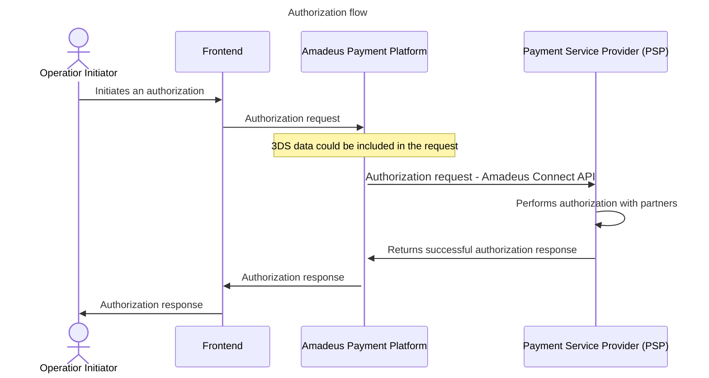
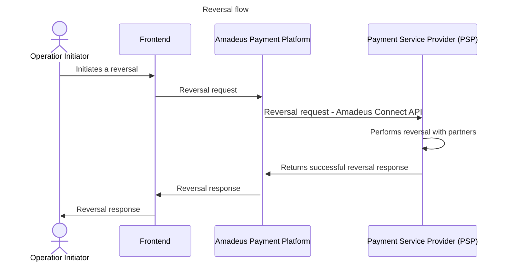
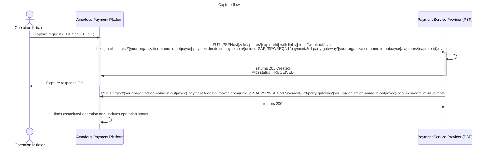
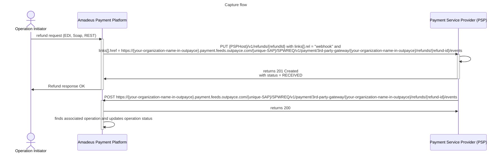

# Connect API CC User Guide 
## **Purpose and Scope**

This user guide describes the payment features and functionalities offered by Outpayce’s Payment Operations swagger, also known as Connect API swagger. The scope of this user guide concerns only Payments done by Credit Card including Apple Pay and Google Pay e-wallet.

This document includes detailed descriptions of all fields currently supported in Connect API as well as detailed examples and scenarios of the payment operations currently supported. The aim of this document is to enhance and supplement the existing swagger specification.

It is recommended to read the data objects/elements together with the swagger specification to understand which data to provide, how and when to provide it. Tables are used in this specification with rows holding the data objects/elements while the applicability columns indicating whether the data element/object is applicable for specific capability.

Applicability is indicated using the following notions:

•	**“M”** - Mandatory:     &nbsp;&nbsp;&nbsp;&nbsp;&nbsp;   *Needed in order to process a request or response through Connect API.*

•	**“C”** - Conditional:  &nbsp;&nbsp;&nbsp;&nbsp;&nbsp;   *May be present or needed depending on the usecase or capability.*
 
• **“O”** - Optional:   &nbsp; &nbsp;  &nbsp;&nbsp;&nbsp;&nbsp;&nbsp;   *Not usually needed to perform a payment transaction but is  added if available.* 
 
•	**“N/A”**   &nbsp;&nbsp; &nbsp;&nbsp;&nbsp;&nbsp;    *If a field is marked N/A for a scheme it means that the field is not part of the transaction to that specific scheme.*

## API Basics
Connect API is a RESTful Service and its endpoints are called using HTTP requests formatted as JSON.

## Environment and URLs
Outpayce provides up to three different environments. Two environments for testing and for you to validate your integration, as well as a Production environment. This allows you to provide  different host for each of the environments.
We use different urls in test and production that follow a specific format for the 4 main operation types supported by Connect API (Authorization, Reversal, Capture & Refund). <br> The url structure is **_https://{your-host-name}/outpayce/v1/{endpoint-path}_** where: 

_**- {your-host-name}**_ is the base URL you provide alongside the endpoint you are using to host the API on your side.<br>
_**- {endpoint-path}**_ is the operation type specific path described in our specification swagger.
 <br><br>
 
However, for payment operations events, a different URL is used:
 
**https://_your-organization-name-in-outpayce.payment.feeds.outpayce.com/{attributed-sap}/SPWREQ/v1/payment/3rd-party-gateway/{your-organization-name-in-outpayce}/{operation-collection}/{operation-id}/events_** where:

_**- {attributed_sap}**_ is a uniquely created sap (service access point) attributed to you that is communicated during the API integration. <br>
_**- {your-organization-name-in-outpayce}**_ is the agreed name attributed by outpayce to you during the onboarding phase. <br>
_**- {payment.feeds.outpayce.com/{attributed-sap}/SPWREQ/v1/payment/3rd-party-gateway}**_ is the Outpayce part of the link that is necessary to target the good component <br>
_**- {operation-collection}**_ is the collection of the concerned operation type. It is therefore either authorizations, reversals, captures or refunds.<br>
_**- {operation-id}**_ is the identifier of the operation generated by Outpayce.

#### URL Examples
 
Payment Operations full URL in test environment :  
###### https://{your-host-name_in-test}/outpayce/v1/authorizations/{operationId}

Payment Operations full URL in production environment : 
###### https://{your-host-name_in-production}/outpayce/v1/authorizations/{operationId}

 
Payment Operations Events URL in test environment:  
###### https://{your-organization-name-in-outpayce}.payment.test.feeds.outpayce.com/{attributed-sap}/SPWREQ/v1/payment/3rd-party-gateway/{your-organization-name-in-outpayce}/captures/{operation-id}/events

Payment Operations Events URL in production environment: 
###### https://{your-organization-name-in-outpayce}.payment.feeds.outpayce.com/{attributed-sap}/SPWREQ/v1/payment/3rd-party-gateway/{your-organization-name-in-outpayce}/captures/{operation-id}/events


## API versioning 

Connect API employs versioning. In any event, Outpayce notifies you of a new release of Connect API. If the newly released version is backwards compatible, you have to update your server code in order to benefit from the new features of this new version. If the new version is not backward compatible (new major version), you have to apply for a new certification process to account for the new major changes. Minor adjustements that are classified as patches, such as text modifications do not prompt a new certification process or API update.

## **Connect API supported capabilities:**
Authorization
•	Basic **Authorization** -> Minimum required data with no 3DsV2 data. <br> 
•	**Authorization** single step -> With capture triggered automatically. <br> 
• **Authorization** 2 Step -> Authorization with dedicated API Capture Request. <br> 
•	**Authorization** with 3DsV2 Data <br> 
•	**Authorization** with Functional Travel Segment data <br> 
•	**Authorization** with Installments data <br> 
•	**Authorization** with E-Wallet data <br> 
•	Full, Partial and Multiple **Reversal** <br> 
•	Full. Patial and Multiple **Capture** <br> 
•	Full, Partial and Multiple **Refund** <br> 
•	**Payment Operation Events** –> Send updates regarding the final status of a capture or refund operation. <br>

## 1 Authorization Operation
### 1.1 Basic Authorization





#### 1.1.1 Description
This is a basic authorization scenario where required Credit Card information is provided to perform a successful authorization. This set of data is always sent as part of an authorization request, regardless of usecase.
#### 1.1.2 Request parameters
| Field | Applicability | Comments | Expected Format | 
|---------------------|---------------|--------------------------------------------------------------------------------|-----------------------------------| 
| id | M | Amadeus operation identifier | string |  
| authorizationType | M | Indicates how the capture is triggered | "AUTHORIZATION_ONLY" or "AUTHOR_AND_CAPTURE" | 
| method | M | Method of Payment requested at authorization time | string Enum: CARD |  
| amount | M | Operation amount | Object | 
| value | M | Value of the amount | string |
| currencyCode | M | Currency of the indicated amount | string, <br> *minLength: 3, maxLength: 3* <br>| 
| card | M | Payment card details | Object |
| vendorCode | M | Payment card scheme | string, <br> *minLength: 2, maxLength: 2* <br>| 
| cardNumber | M | Credit card number | string | 
| cvv | M |  Card verification value, also known as card security code | string; <br> *min Length: 3, max Length: 4* <br> | 
| expiryDate | M | Credit card expiry date | string | 

##### Basic Authorization request example:

```json
  PUT https://{your-host-name}/outpayce/v1/authorizations/{authorizationId} HTTP/1.1
  Content-Type: application/vnd.amadeus+json
  ...
{
  "data": {
    "id": "{authorizationId}",
    "amount": {
      "value": "123.45",
      "currencyCode": "EUR"
    },
    "authorizationType": "AUTHORIZATION_ONLY",
    "method": "CARD",
    "card": {
      "vendorCode": "VI",
      "cardNumber": "4000000000000001",
      "cvv": "123",
      "expiryDate": "2024-12"
    }
  }
}
```

#### 1.1.3 Response parameters
The table below contains the minimum amount of data Outpayce expects to receive in the response of a succesful authorization. Without at least the fields tagged as **Mandatory**, Outpayce is not able to process the Authorization response. <br>
   | Object/Field Name   | Applicability   | Comments                                                          | Expected Format   |
   |----------------------|------------------|-------------------------------------------------------------------|--------------------|
   | id                   | O                | Amadeus operation identifier                                     | string             |
   | method               | O                | Method of Payment requested at authorization time              | string Enum: CARD   |
   | timestamp            | O                | Datetime of the operation                                          | String,    Format: <br> *"date-time"* <br> |
   | approvalCode         | M                | Approval code of the processed Authorization request             | string, <br> *minLength: 6, maxLength: 8* <br>             |
   | card                 | O                | Payment card details                                             | Object             |
   | vendorCode           | O                | Payment card scheme                                               | string, <br> *minLength: 2,  maxLength: 2* <br>|
   | maskedCardNumber     | O                | Obfuscated credit card number                                              | string             |
   | externalId           | O                | Identifier of the operation generated by the service host      | string             |
   | schemeTransactionId  | O                | Identifier of the payment transaction in the card scheme system   | string             |


##### Basic Authorization response example:

```json
HTTP/1.1 201 Created
Location: https://{your-host-name}/outpayce/v1/authorizations/{authorizationId}
Content-Type: application/vnd.amadeus+json

{
  "data": {
    "id": "authorizationId",
    "method": "CARD",
    "card": {
      "vendorCode": "VI",
      "maskedCardNumber": "400000------0001"
      },
    "approvalCode": "APPROVAL_CODE",
    "timestamp": "2022-11-28T13:37:00Z"
  }
}
```

### 1.2 Authorization with additional data
  #### 1.2.1 Description
  The table below covers different types of additional data that may be included in an authorization request. These data fields serve various use cases:
  - Merchant and acquirer details: Allow the partner to identify the merchant account impacted by the operation and enable the acquirer to process and accept the transaction.
  - Cardholder information (e.g., holderName): Used for cardholder identification and compliance.
  - Reconciliation references (e.g., pspReconciliationReference): Support payment settlement and reconciliation processes.
  - Interaction context (e.g., holderInteractionMode): Describes how the cardholder interacted with the payment system.
  Outpayce automatically sends any of these data fields in the request if they are received from the API consumer.
   #### 1.2.2 Request parameters
   The same data in a *basic authorization* request is provided, alongside the additional data highlighted below:
| Fields | Applicability | Comments | Expected Format | 
|--------------------------|------------------|-------------------------------------|------------------------|
| OperationContext | O |  | Object |
| merchantAccount | O | Merchant details | object |
| merchantAccount.name | O | Name identifying the merchant in the service host system | string |
| merchantAccount.login | O | Login of a user registered in the service host system and belonging to the merchant | string |
| merchantAccount.password.payload | O | User password | string |
| acquirerInformation | O |  | Object |
| acquirerInformation.acquirerBin | O | Acquirer Bank Identifier Number | string | 
| acquirerInformation.acquirerCountry | O | ISO 3166-1 country code of the acquirer | string | 
| holderName | O | Card holder full name registered against that payment card | string |
| pspReconciliationReference | O             | Authorization PSP reference provided for reconciliation purpose (also identified as PRR in other Amadeus payment applications). This reference is generated by the payee to reconcile the payment settlement against the sales. | String                                        |
| pointOfInteraction.operatingEnvironment.holderInteractionMode | O         | Describes how the cardholder interacted                                                                                                        | String, Enum: ECOMMERCE, FACE_TO_FACE, MAIL_ORDER, HOLDER_NOT_PRESENT, PHONE_ORDER, RECURRING, ON_FILE |

   #### 1.2.3 Response parameters
   The same response as basic authorization is expected.
   ### 1.3 Authorization with sales summary data
   #### 1.3.1 Description
   This is an authorization request populated with sales summary data which can include flight and passenger details.
   #### 1.3.2 Request parameters
  The same data in a basic authorization request is provided, alongside the additional data highlighted below:
  | Field | Applicability | Comments | Expected Format | 
   |------------------------------|---------|-----------------------------------------------------------------------------------------------------------------|------------------------------------------------|
   | purposeOfOperation | O | Purpose of the payment operation |Object |
   | purposeOfOperation.sales[] | O| Payment operation of the type Sales | Array of Objects | 
   | reference |O | Reference identifying the sales |string  | 
   | referenceType |O  | Type of the reference identifying the sales | string| 
   | referenceOwner | O | Owner of reference type |string | 
   | salesItems[] |O | Sales items information | Array of Objects | 
   | category |O  | Category best qualifying the sales item |String, Enum: FLIGHT | 
   | flightSalesDetails |O | Flight detailed item description as a sales summary item |Object  | 
   | flightLegs[] | O | Flight itinerary details associated to a given passenger as sales summary flight details at flight segment level | Array of Objects | 
   | fareBasisCode | O | Airline fare basis code identifying a fare type |String| 
   | departureAirportCode | O | IATA 3-letter code representing the airport of departure of that flight leg | string|
   | departureTime |O | UTC date and time of the scheduled departure, compliant with ISO8601 | string | 
   | arrivalAirportCode |O | IATA 3-letter code representing the airport of arrival of that flight leg |string  | 
   | arrivalTime |O  | UTC date and time of the scheduled arrival, compliant with ISO8601 | string| 
   | carrierCode | O | IATA code of the carrier in charge of that flight segment |string | 
   | couponNumber | O | Flight coupon number |string | 
   | flightNumber |O  | Flight number associated to the carrier in charge of that flight segment |string |
   | serviceClass |O  | Reference identifying the class of travel and included services |string | 
   | travelDate |O  | Day when travel over that segment begins |string | 
   | passenger | O | Passenger of the flight | Object| 
   | passenger.flightPassengerType | O | Specifies flight passenger type | string, Enum: ADULT, CHILD, INFANT, INFANT_WITH_SEAT| 
   | name |O | Description of the name of a physical person |Object  | 
   | firstName | O | Passenger’s first name |string | 
   | lastName |O  | Passenger’s last name |string |
   | travelAgencyCode| O | Code identifying the travel agency responsible for the sale| string|
   | travelAgencyName| O | Name of the travel agency responsible for the sale| string|
   | issuingCarrierCode| O  | IATA code of the validating carrier| string|

#### 1.3.3 Response parameters
   The same response as basic authorization use-case is expected.
###	1.4 Authorization with 3DsV2 Data
   #### 1.4.1 Description
   This is an authorization request populated with 3DSv2 authentication details.
   #### 1.4.2 Request parameters
 The same data in a basic authorization request is provided, alongside the additional data highlighted below:
   | Object/Field Name          | Applicability | Comments                                                                                                              | Expected Format        |
|----------------------------|---------------|------------------------------------------------------------------------------------------------------------------------|-------------------------------|
| OperationContext           | C             | Object                                                                                                                 |            |
| threeDomainSecure           | C             | Operation 3-Domain Secure information.                                                                               | Object           |
| collectionIndicator        | C             | UCAF collection indicator value. Used for Mastercard only. Equivalent of the eci for all other card schemes.    | string            |
| aav                        | C             | UCAF Accountholder Authentication Value. Used purely by Mastercard scheme.                                            | string       |
| cavv                       | C             | Base64-encoded Cardholder Authentication Verification Value. Used by all other card schemes that do not include MasterCard and American Express. | String       |
| aevv                       | C             | Base64-encoded American Express Verification Value.                                                                  | string         |
| eci                        | C             | Computed e-commerce indicator.                                                                                        | string          |
| transStatus                | C             | 3-D Secure 2.x (or later) Final Authentication Result.                                                               | string            |
| dsTransactionId            | C             | 3-D Secure 2.x (or later) Directory Server Transaction Identifier.                                                   | string         |
| version                    | C             | 3-D Secure protocol version.                                                                                          | string      |

 ##### This is the	3DSV2 Matrix for the different schemes:
  This table shows which authentication and indicator fields are used for each card scheme when processing 3DS transactions.


   | Card Type   | Field                               |
   |-------------|-------------------------------------|
   | **Authentication Values** |  |
   | Amex | aevv |
   | Mastercard  | aav   |
   | Visa and other vendors | cavv |
   | **Indicator Values** |  |
   | Visa, Amex and other vendors  | ECI value |
   | Mastercard  | Collection Indicator |
   
   
   #### 1.4.3 Response parameters
   The same response as basic authorization use-case is expected.
### 1.5 Authorization with Card on File Capabilities
#### 1.5.1 Initial Storing request of CC details
##### 1.5.1.1 Description
This is an authorization scenario where the cardholder initiates the transaction and CC credentials are stored for the first time. On top of setting the field _transactionInitiator_ as **'HOLDER'**, the API consumer also indicates the _instrumentFilingRequest_ of **'STORING'**
##### 1.5.1.2 Request parameters
   The same data in a basic authorization request is provided, alongside the additional data highlighted below:
| Field | Applicability | Comments | Expected Format | 
|---------------------|---------------|--------------------------------------------------------------------------------|-----------------------------------| 
| OperationContext | C | Object | |
| termsAndConditions  |   C |                   |      Object  |
| credentialsOnFile  |   C |                  |      Object  |
| instrumentFilingRequest  | C | Indicate whether the transaction is the one where the credential are being stored for the first time or it is a subsequent follow up transaction that is performed using stored credentials. |  string |

##### 1.5.1.3 Response parameters
   The same response as basic authorization use-case is expected.
#### 1.5.2 Cardholder Initiated Transaction with Card on File
##### 1.5.2.1 Description
This is an authorization scenario where the cardholder initiates the transaction using stored credentials. On top of setting the _transactionInitiator_ as **'HOLDER'**, the API consumer also indicates the _instrumentFilingRequest_ of **'REUSE'**.
##### 1.5.2.2 Request parameters
   The same data fiels in a basic authorization request is provided, alongside the additional data fields highlighted below:

| Field | Applicability | Comments | Expected Format | 
|---------------------|---------------|--------------------------------------------------------------------------------|-----------------------------------| 
|transactionIntent|C|           |String|
|interactionCondition|C|                     |String|

##### 1.5.2.3 Response parameters
   The same response as basic authorization use-case is expected.
#### 1.5.3 Merchant Initiated Transaction with Card on File
##### 1.5.3.1 Description
This is an authorization scenario where the merchant initiates the transaction, on behalf of the cardholder. In that case, on top of setting the _transactionInitiator_ as **'MERCHANT'**, this time the API consumer also indicates the _instrumentFilingRequest_ of **'REUSE'**.
##### 1.5.3.2 Request parameters
The same fields than Cardholder Initiated Transaction with Card on File.
##### 1.5.3.3 Response parameters
   The same response as basic authorization use-case is expected.

### 1.6 Authorization with Installments

#### 1.6.1 Description  
This is an authorization request that includes support for **installment-based payments**. It is used when a cardholder opts to split the transaction amount into multiple payments over time.

#### 1.6.2 Request Parameters  
The same data in a basic authorization request is provided, alongside the additional fields listed below, which should be included in the object operationContext.termsAndConditions.installments.

| Object/Field Name                            | Applicability | Comments                                                               | Expected Format                  |
|---------------------------------------------|---------------|------------------------------------------------------------------------|----------------------------------|
| firstInstallmentAmount.value                 | O             | The amount of the first installment.                                   | string                           |
| firstInstallmentAmount.currencyCode          | O             | Currency of the first installment.                                     | string                           |
| interestAmount.value                         | O             | The interest amount applied to the installment plan.                   | string                           |
| interestAmount.currencyCode                  | O             | Currency of the interest amount.                                       | string                           |
| subsequentInstallmentAmount.value            | O             | Amount for each installment after the first.                           | string                           |
| subsequentInstallmentAmount.currencyCode     | O             | Currency of the subsequent installments.                               | string                           |
| maxNumber                                    | O             | Maximum number of installments allowed.                                | integer                          |
| period.frequencyType                         | O             | Frequency at which installments are charged.                           | Enum: DAILY, WEEKLY, MONTHLY |


#### 1.6.3 Response Parameters  
   The same response as basic authorization use-case is expected.

#### Extract of the installment request example:

```json
{
    "termsAndConditions": {
        "installments": {
            "firstInstallmentAmount": {
                "value": "430.55",
                "currencyCode": "BRL"
            },
            "interestAmount": {
                "value": "30.00",
                "currencyCode": "BRL"
            },
            "subsequentInstallmentAmount": {
                "value": "50.00",
                "currencyCode": "BRL"
            },
            "maxNumber": 3,
            "period": {
                "frequencyType": "MONTHLY"
            }
        }
    }
}
```

### 1.7 Authorization with Wallet Payments

#### 1.7.1 Description
This is an authorization scenario where digital wallet payment methods (Apple Pay, Google Pay) are used instead of traditional card details. The wallet provider handles the tokenization and encryption of the payment data, providing enhanced security through cryptographic tokens.

#### 1.7.2 Request parameters
The same data in a basic authorization request is provided, alongside the wallet-specific data highlighted below under `data.card`:

| Field | Applicability | Comments | Expected Format | 
|---------------------|---------------|--------------------------------------------------------------------------------|-----------------------------------| 
| wallet | C | Digital wallet information | Object |
| walletType | C | Type of digital wallet used | string, soft enum: APPLEPAY, GOOGLEPAY |
| provider | C | Wallet provider identifier | string, soft enum: APPLE, GOOGLE |

And under `data.operationContext`:

| Field | Applicability | Comments | Expected Format | 
|---------------------|---------------|--------------------------------------------------------------------------------|-----------------------------------| 
| applePayTokenContext | O | Apple Pay specific token data (required when walletType is APPLEPAY) | Object |
| googlePayTokenContext | O | Google Pay specific token data (required when walletType is GOOGLEPAY) | Object |
| cryptogramEci | O | Electronic Commerce Indicator| string |
| cryptogram | O | Base64-encoded cryptogram| string |

##### Wallet Authorization request example (Apple Pay):

```json
PUT https://{your-host-name}/outpayce/v1/authorizations/{authorizationId} HTTP/1.1
Content-Type: application/vnd.amadeus+json
...
{
  "data": {
    "id": "{authorizationId}",
    "amount": {
      "value": "500.00",
      "currencyCode": "USD"
    },
    "authorizationType": "AUTHORIZATION_ONLY",
    "method": "CARD",
    "card": {
      "holderName": "John Doe",
      "vendorCode": "VI",
      "tokenizedCardNumber": "4444339999991118",
      "expiryDate": "2030-03",
      "wallet": {
        "walletType": "APPLEPAY",
        "provider": "APPLE"
      }
    },
    "operationContext": {
      "applePayTokenContext": {
        "cryptogramEci": "05",
        "cryptogram": "BQGoWH66A8LIMg0j9CuVSQABAAA="
      },
      "merchantAccount": {
        "name": "1234"
      }
    }
  }
}
```

#### 1.7.3 Response parameters
   The same response as basic authorization use-case is expected.

## 2 Reversal Operation


### 2.1 Basic Reversal 
These are the fields that always are incorporated in the Payload of the request sent by Outpayce. This refers to the minimum amount of information needed to perform a Reversal request.
#### 2.1.2 Request fields
| Object/field name | Applicability | Comments                                                      | Expected format |
|-------------------|---------------|---------------------------------------------------------------|------------------|
| id                | M             | Amadeus operation identifier.  This identifier is generated by Amadeus Payment Platform and uniquely represents this operation.     | string           |
| parentOperationId | M             | Identifier of a previous Authorization operation belonging to the same payment.      | string           |
| timestamp         | M             | Datetime of the operation.                                      | string           |
| amount            | M             | Operation amount.                                              | Object           |
| value             | M             | Value of the amount.                                           | string           |
| currencyCode      | M             | Currency of the indicated amount.                               | String, <br> *minLength: 3, maxLength: 3* <br> |
| approvalCode      | M           | Approval code of a previously processed Authorization request. | string, <br> *minLength: 6, maxLength: 8* <br>   |
| method            | M            | Method of Payment requested at authorization time.               | String Enum:  CARD   |


#### 2.1.3 Response fields
| Object/field name | Applicability | Comments | Expected format |
|---------------------|---------------|---------------------------------------------------------------|------------------| 
| id | O | Amadeus operation identifier. | This identifier is generated by Amadeus Payment Platform and  uniquely represents this operation | String | 
| parentOperationId | O | Identifier of a previous operation belonging to the same payment. | String| 
| method | O | Method of Payment requested at authorization time. | String Enum: CARD | 
| timestamp | O | Datetime of the operation. | string |
| approvalCode | M | Approval code of the processed Authorization request. | string, <br> *minLength: 6, maxLength: 8* <br> |
| card | O | Payment card details. | Object | 
| vendorCode | O | Payment card scheme. | String, <br> *minLength: 2*, *maxLength: 2* <br>| 
| maskedCardNumber | O | Credit card number. | string |

The table above contains the minimum amount of data Outpayce expects to receive in the response. Without at least the fields tagged as **Mandatory**, Outpayce is not able to process the Reversal response. <br>

### 2.2 Reversal with optional data
If merchant, acquirer or extra payment method details are needed/provided, these are automatically added to the request payload.

#### 2.2.1 Request fields
The same data in a basic Reversal request is provided, alongside the additional data highlighted below if available:

| Object/field name              | Applicability | Comments                                                        | Expected format |
|--------------------------------|---------------|-----------------------------------------------------------------|------------------|
| card                           | O            | Payment card details.                                            | Object           |
| vendorCode                     | O             | Payment card scheme.                                             | String, <br> *minLength: 2, maxLength: 2* <br> |
| cardNumber                     | O          | Credit card number.                                              | string           |
| expiryDate                     | O             | Credit card expiry date.                                         | string           |
| holderName                     | O             | Card holder full name registered against that payment card.     | string           |
| OperationContext               | O             | Object                                                          |                  |
| merchantAccount                | O             | Merchant details.                                               | Object           |
| merchantAccount.name           | O             | Name identifying the merchant in the service host system.       | string           |
| merchantAccount.login          | O             | Login of a user registered in the service host system and belonging to the merchant.       | string           |
| merchantAccount.password.payload| O             | User password.                                                  | string           |
| acquirerInformation            | O             |                                                                 |                  |
| acquirerInformation.acquirerBin                          |    O   | Acquirer Bank Identifier Number.                                 | string           |
| acquirerInformation.acquirerCountry| O     |           ISO 3166-1 country code of the acquirer.       |       String  |  

#### 2.2.2 Response fields
The same response as basic reversal use-case is expected.


## 3 Capture Operation


### 3.1 Capture simple request
These are the fields that always are incorporated in the Payload of the request sent by Outpayce. The minimum amount of information needed to perform a Capture request.

#### 3.1.1 Request
| Object/Field Name | Applicability | Comments | Expected Format | 
|----------------------|---------------|------------------------------------------------------------------------------|------------------|
| id | M | Amadeus operation identifier. This identifier is generated by Amadeus Payment Platform and uniquely represents this operation. | string | 
| parentOperationId | M | Identifier of a previous Authorization operation belonging to the same payment. | String |
| method | M | Method of Payment requested at authorization time. | String Enum: CARD|
| approvalCode | M | Approval code of a previously processed Authorization request. | string, <br> *minLength: 6, maxLength: 8* <br> |
| timestamp | M | Datetime of the operation. | string |
| amount | M | Operation amount. | Object |
| value | M | Value of the amount. | string | 
| currencyCode | M | Currency of the indicated amount. | string, <br> *minLength: 3, maxLength: 3* <br> | 
| card | M | Payment card details. | Object |
| vendorCode | M | Payment card scheme. | string, <br> *minLength: 2, maxLength: 2* <br>|
| cardNumber | M | Credit card number. | string |
| expiryDate | M | Credit card expiry date. | string |
| OperationContext | M | | Object | 
| links | M | | object | 
| rel | M | Relation of the link. In addition to IANA standard relations, payment area bears domain specific ones: "webhook" to indicate where the API consumer is expected to update the status of a specific operation. Please refer to the Payment Operation Events API for more details. | string | 
| href | M | Absolute or relative URL. | string |

#### 3.1.2 Response

| Object/Field Name   | Applicability | Comments                                                                   | Expected Format |
|----------------------|---------------|------------------------------------------------------------------------------|------------------|
| id                   | O             | Amadeus operation identifier. This identifier is generated by Amadeus Payment Platform and uniquely represents this operation. | string  |
| parentOperationId   | O             | Identifier of a previous operation belonging to the same payment.             | string           |
| method              | O             | Method of Payment requested at authorization time.                            | String Enum: CARD|
| timestamp           | O             | Datetime of the operation.                                                   | string, format: <br> *"date-time"* <br> |
| approvalCode        | O             | Approval code of the processed Authorization request.                        | string, <br> *minLength: 6, maxLength: 8* <br>           |
| status              | M             | Operation status. For CARD method of payment, this value must be "RECEIVED" and must be present in CAPTURE & REFUND Operation responses. Otherwise, Outpayce System is not able to process the transaction. | String Expected value: RECEIVED in case of CC method of payment |
| amount              | O             | Operation amount.                                                           | Object           |
| value               | O             | Value of the amount.                                                        | string           |
| currencyCode        | O             | Currency of the indicated amount.                                            | String     | <br> *minLength: 3,  maxLength: 3* <br>   |

The table above contains the minimum amount of data Outpayce expects to receive in the response. Without at least the fields tagged as **Mandatory**, Outpayce is not able to process the Capture response. <br>

### 3.2 Capture request with optional data
#### 3.2.1 Request
The same data in a basic Capture request is provided, alongside the additional data highlighted below:
 
| Object/Field Name          | Applicability | Comments                                                                   | Expected Format |
|-----------------------------|---------------|------------------------------------------------------------------------------|------------------|
| card                       | O             | Payment card details.                                                       | Object           |
| holderName                 | O             | Card holder full name registered against that payment card.                  | string           |
| operationContext          | O             |                                                                              | Object           |
| merchantAccount            | O             | Merchant details.                                                           | Object           |
| merchantAccount.name       | O             | Name identifying the merchant in the service host system.                    | string           |
| merchantAccount.login      | O             | Login of a user registered in the service host system and belonging to the merchant. | string           |
| merchantAccount.password.payload | O        | User password.                                                              | string           |
| acquirerInformation        | O             |                                                                              |                  |
| acquirerInformation.acquirerBin | O        | Acquirer Bank Identifier Number.                                            | string           |
| acquirerInformation.acquirerCountry | O   | ISO 3166-1 country code of the acquirer.                                    | string           |
| purposeOfOperation         | O            | Purpose of the payment operation.                                            | Object           |
| purposeOfOperation.sales[] | O| Array containing the different sales details related to the operation | Array of Objects | 
| reference |O | Reference identifying the sales |string  | 
| referenceType |O  | Type of the reference identifying the sales | string| 
| referenceOwner | O | Owner of reference type |string | 
| salesItems[] |O | Sales items information | Array of Objects | 
| category |O  | Category best qualifying the sales item |String Enum: FLIGHT, LODGING| 
| flightSalesDetails |O | Flight detailed item description as a sales summary item |Object  | 
| flightLegs[] | O | Flight itinerary details associated to a given passenger | Array of Objects | 
| fareBasisCode | O | Airline fare basis code identifying a fare type |String| 
| departureAirportCode | O | IATA 3-letter code representing the airport of departure of that flight leg | string|
| departureTime |O | UTC date and time of the scheduled departure, compliant with ISO8601 | string | 
| arrivalAirportCode |O | IATA 3-letter code representing the airport of arrival of that flight leg |string  | 
| arrivalTime |O  | UTC date and time of the scheduled arrival, compliant with ISO8601 | string| 
| carrierCode | O | IATA code of the carrier in charge of that flight segment |string | 
| couponNumber | O | Flight coupon number |string | 
| flightNumber |O  | Flight number associated to the carrier in charge of that flight segment |string |
| serviceClass |O  | Reference identifying the class of travel and included services |string | 
| travelDate |O  | Day when travel over that segment begins |string | 
| passenger | O | Passenger of the flight | Object| 
| name |O | Description of the name of a physical person |Object  | 
| firstName | O | Passenger’s first name |string | 
| lastName |O  | Passenger’s last name |string | 

#### 3.2.2 Response

The same response as basic capture use-case is expected.

## 4 Refund Operation

### 4.1 Refund simple request
These are the fields that are always incorporated in the Payload of the request sent by Outpayce. The minimum amount of information needed to perform a Refund request.

#### 4.1.1 Request
| Object/Field Name | Applicability | Comments | Expected Format | 
|----------------------|---------------|------------------------------------------------------------------------------|------------------|
| id | M | Amadeus operation identifier. This identifier is generated by Amadeus Payment Platform and uniquely represents this operation. | string | 
| parentOperationId | M | Identifier of a previous Authorization operation belonging to the same payment. If authorization operation is not retrievable, the identifier of the Capture Operation is used instead. | String |
| method | O | Method of Payment requested at authorization time. | String Enum: CARD|
| approvalCode | O | Approval code of a previously processed Authorization request. | string, <br> *minLength: 6, maxLength: 8* <br> |
| timestamp | M | Datetime of the operation. | string |
| amount | O | Operation amount. | Object |
| value | O | Value of the amount. | string | 
| currencyCode | O | Currency of the indicated amount. | string,  <br> *minLength: 3, maxLength: 3* <br> | 
| card | O | Payment card details. | Object |
| vendorCode | O | Payment card scheme. | String, <br> *minLength: 2, maxLength: 2* <br> |
| cardNumber | O | Credit card number. | string |
| expiryDate | O | Credit card expiry date. | string |
| OperationContext | C | | Object | 
| links | C | | object | 
| rel | C | Relation of the link. In addition to IANA standard relations, payment area bears domain specific ones: "webhook" to indicate where the API consumer is expected to update the status of a specific operation. Please refer to the Payment Operation Events API for more details. | string | 
| href | C | Absolute or relative URL. | string |

#### 4.1.2 Response

| Object/Field Name   | Applicability | Comments                                                                   | Expected Format |
|----------------------|---------------|------------------------------------------------------------------------------|------------------|
| id                   | O             | Amadeus operation identifier. This identifier is generated by Amadeus Payment Platform and uniquely represents this operation. | string  |
| parentOperationId   | O             | Identifier of a previous operation belonging to the same payment.             | string           |
| method              | O             | Method of Payment requested at authorization time.                            | String Enum: CARD|
| timestamp           | O             | Datetime of the operation.                                                   | String, format: <br> *"date-time"* <br>       |
| approvalCode        | O             | Approval code of the processed Authorization request.                        | string, <br> *minLength: 6, maxLength: 8* <br>           |
| status              | M             | Operation status. For CARD method of payment, this value must be "RECEIVED" and must be present in CAPTURE & REFUND Operation responses. Otherwise, Outpayce System is not able to process the transaction. | String Expected value: RECEIVED in case of CC method of payment |
| amount              | O             | Operation amount.                                                           | Object           |
| value               | O             | Value of the amount.                                                        | string           |
| currencyCode        | O             | Currency of the indicated amount.                                            | String     | <br> *minLength: 3, maxLength: 3* <br>  |

The table above contains the minimum amount of data Outpayce expects to receive in the response. Without at least the fields tagged as **Mandatory**, Outpayce is not able to process the Refund response. <br>

#### 4.2 Refund request with optional data

##### 4.2.1 Request
The same data in a basic Capture request is provided, alongside the available additional data highlighted below:

| Object/Field Name          | Applicability | Comments                                                                   | Expected Format |
|-----------------------------|---------------|------------------------------------------------------------------------------|------------------|
| holderName                 | O             | Card holder full name registered against that payment card.                  | string           |
| OperationContext          | O             |                                                                              | Object           |
| merchantAccount            | O             | Merchant details.                                                           | Object           |
| merchantAccount.name       | O             | Name identifying the merchant in the service host system.                    | string           |
| merchantAccount.login      | O             | Login of a user registered in the service host system and belonging to the merchant. | string           |
| merchantAccount.password.payload | O        | User password.                                                              | string           |
| acquirerInformation        | O             |                                                                              |                  |
| acquirerInformation.acquirerBin | O        | Acquirer Bank Identifier Number.                                            | string           |
| acquirerInformation.acquirerCountry | O   | ISO 3166-1 country code of the acquirer.                                    | string           |
| purposeOfOperation         | O            | Purpose of the payment operation.                                            | Object           |
| purposeOfOperation.sales[]  | O            | Payment operation of the type Sales.                                         | Array Object     |
| salesItems[]               | O            | Sales items information.                                                    | Array Object     |
| flightSalesDetails         | O            | Flight detailed item description as a sales summary item.                   | Object           |
| ticketNumber               | O          | Ticket number of the flight. Not present at Authorization time.             | string           |

##### 4.2.2 Response
The same response as basic refund use-case is expected.

## 5 Payment operations events
### 5.1	Pre-requisite - Operation creation

Outpayce sent a payment operation to your system that accepted it. This operation is identified by its nature (i.e. capture or refund) and its id. 

In the payload of the operation request, you received a **_WEBHOOK_URL_** to which you can post Events. This **_WEBHOOK_URL_** respects the following pattern: 

**_https://{your-organization-name-in-outpayce}.payment.feeds.outpayce.com/{unique-SAP}/SPWREQ/v1/payment/3rd-party-gateway/{your-organization-name-in-outpayce}/{operation-collection}/{operation-id}/events_**

In this pattern, _unique-SAP_ is a newly unique created SAP by Outpayce, _your-organization-name-in-Outpayce_ is the agreed name attributed by Outpayce to you during the onboarding phase. *operation-collection* is the collection of the concerned operation nature. It is therefore either *captures* or *refunds*. *operation-id* is the identifier of the operation generated by Outpayce.
For more details about this step, please refer to the Payment Operations swagger

### 5.2 Request parameters

| Field | Applicability | Comments | Expected Format | 
|---------------------|---------------|--------------------------------------------------------------------------------|-----------------------------------| 
| triggerEventName | M | Describes the nature of the event. We expect that this is the final status of the operation.  | string |  
| triggerEventReason | O | Reason why this event has been triggered. Free text. | string | 
| dateTime | O | time of the change (ISO 8601)  | string, Format: <br> *"date-time"* <br> |  
| triggerEventCodedReason | O | To be used by application that has a requirement to send the code and the description of the code | Object | 
| code | O | This field returns the code setup by an organization | string | 
| text | O | Free Text | string |

The field *triggerEventReason* field must contain one of the following:

•	**CAPTURE_CLEARED**: both acquirer and issuer agreed on the clearing of the operation.<br>
•	**CAPTURE_FAILURE**: a technical issue prevented the operation to be cleared.<br>
•	**CAPTURE_DENIAL**: the issuer or the acquirer denied the clearing request.<br>
•	**REFUND_CLEARED**: both acquirer and issuer agreed on the clearing of the operation.<br>
•	**REFUND_FAILURE**: a technical issue prevented the operation to be cleared.<br>
•	**REFUND_DENIAL**: the issuer or the acquirer denied the clearing request.

##### Payment operation event request example:

```json
  POST your-organization-name-in-outpayce.payment.feeds.outpayce.com/v1/payment/3rd-party-gateway/{your-organization-name-in-outpayce}/{operation-type}/{operation-id}/events
  Content-Type: application/vnd.amadeus+json
  ...
{
    "data": {
        "triggerEventName": "CAPTURE_CLEARED",
        "dateTime": "2033-12-31T04:54:00Z"
    }
}
```

### 5.3 Response parameters
Outpayce parses the event and after processing it, returns an acknowledgment response.

| Field | Applicability | Comments | Expected Format | 
|---------------------|---------------|--------------------------------------------------------------------------------|-----------------------------------| 
| status | M | Operation status.  | string |  

**NB:** IP whitelisting is used as security on 1A side.

##### Payment operation event response example:

```json
  HTTP/1.1 200 OK
  Content-Type: application/vnd.amadeus+json
  ...
{
    "data": {
        "status": "ACKNOWLEDGED"
    }
}
```

## 6 Warnings and Error Handling 

Warnings are non-blocking issues encountered during processing. Errors are functionally blocking issues preventing a successful processing. Today Connect API supports only error issues.
In case an error is triggered, Outpayce expects to receive a response following the specific format described in the provided swagger. 

For a full list of existing HTTP Status Codes as well as supported error codes, please refer to the main Connect API Swagger. 
Please remember the code provided must be part of the existing list or Outpayce is not able to process the response sent.

### 6.1 Error response parameters

| Field | Applicability | Comments | Expected Format | 
|---------------------|---------------|--------------------------------------------------------------------------------|-----------------------------------| 
| status | O | The HTTP status code of this response. This is present only in terminal errors which cause an unsuccessful response. In the case of multiple errors, they must all have the same status.  | integer |  
| code | M | A machine-readable error code from the Amadeus Canned Messages table, that enables the API Consumers code to handle this type of error. | integer | 
| title | M | An error title from the Canned Messages table with a 1:1 correspondence to the error code. This may be localized.  | string |  
| detail | O | An easy-to-read explanation specific to this occurrence of the problem. It should give the API consumer an idea of what went wrong and how to recover from it. Like the title, this field’s value can be localized. | string | 
| source | O | Parameters and fields indicating details concerning the source of the error. | Object |
| parameter | O | The key of the URI path or query parameter that caused the error. | string |
| pointer | O | A JSON Pointer RFC6901 to the associated entity in the request body that caused this error. | string |
| example | O | A sample input to guide the user when resolving this issue. | string |

Two fields are always expected to be received in case of an Error response, however the response can be enhanced with additional fields to convey more specific information regarding the error use case.

##### Error response example:

```json
HTTP/1.1 400 BAD REQUEST
Content-Type: application/vnd.amadeus+json
  ...
    {  
        "errors": [
            {
              "status": 400,
              "code": 477,
              "title": "INVALID FORMAT",
              "detail": "The currency code is invalid",
              "source":
              {
                "parameter": "amount/currencyCode"
              }
            }
          ]
        }
```